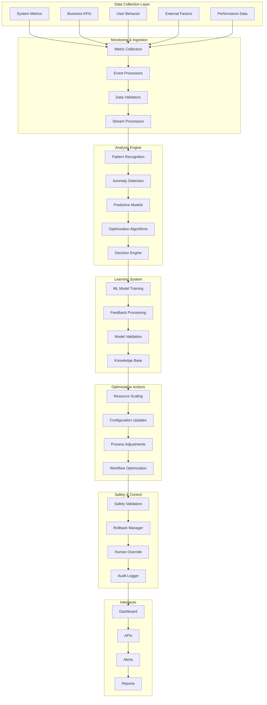

# Technical Architecture: Autonomous Optimization Design Pattern

## Architecture Overview

The Autonomous Optimization Design Pattern implements a self-managing system that continuously monitors, analyzes, and optimizes business processes and system performance without human intervention. This architecture leverages AI/ML algorithms, real-time analytics, and automated decision-making to achieve optimal operational efficiency.

### Key Architectural Principles
- **Self-Monitoring**: Continuous observation of system metrics and business KPIs
- **Intelligent Analysis**: AI-driven pattern recognition and anomaly detection
- **Autonomous Decision Making**: Automated optimization actions based on learned patterns
- **Adaptive Learning**: Continuous improvement through feedback loops
- **Safe Automation**: Built-in safeguards and rollback mechanisms

## System Architecture Diagram



## Component Architecture Details

### Data Collection Components

**System Metrics Collectors**
- Infrastructure monitoring (CPU, memory, network, storage)
- Application performance metrics (response time, throughput)
- Database performance indicators
- Network latency and bandwidth utilization

**Business KPI Monitors**
- Revenue and cost metrics
- Customer satisfaction scores
- Operational efficiency indicators
- Quality metrics and SLA compliance

**Behavioral Analytics**
- User interaction patterns
- System usage analytics
- Process execution flows
- Resource consumption patterns

### Analysis Engine Components

**Pattern Recognition Engine**
- Time series analysis algorithms
- Seasonal pattern detection
- Correlation analysis
- Trend identification and forecasting

**Anomaly Detection System**
- Statistical anomaly detection
- Machine learning-based outlier detection
- Multi-dimensional anomaly analysis
- Real-time anomaly scoring

**Predictive Analytics**
- Demand forecasting models
- Capacity planning algorithms
- Performance degradation prediction
- Failure prediction models

**Optimization Algorithms**
- Multi-objective optimization
- Genetic algorithms
- Reinforcement learning
- Constraint satisfaction solvers

### Learning System Components

**Model Training Pipeline**
- Automated feature engineering
- Model selection and hyperparameter tuning
- Cross-validation and testing
- Model versioning and deployment

**Feedback Loop Processing**
- Action outcome analysis
- Performance impact assessment
- Model accuracy evaluation
- Continuous learning updates

## Data Flow Architecture

### Monitoring Flow
```
Data Sources → Collection Agents → Stream Processing → Real-time Analytics → Pattern Detection
```

### Analysis Flow
```
Processed Data → Feature Engineering → Model Inference → Optimization Recommendations → Decision Validation
```

### Action Flow
```
Validated Decisions → Safety Checks → Action Execution → Impact Monitoring → Feedback Collection
```

### Learning Flow
```
Historical Data → Model Training → Validation Testing → Model Deployment → Performance Monitoring
```

## Security Architecture

### Data Protection
- End-to-end encryption for sensitive metrics
- Secure data transmission protocols
- Data anonymization for privacy protection
- Secure storage with access controls

### Access Control
- Role-based access to optimization controls
- API authentication and authorization
- Multi-factor authentication for critical actions
- Audit trails for all system changes

### System Security
- Secure communication between components
- Container security and image scanning
- Network segmentation and firewalls
- Regular security assessments

### Compliance & Governance
- Regulatory compliance monitoring
- Data governance policies
- Change management procedures
- Risk assessment frameworks

## Performance & Scalability

### Horizontal Scaling
- Microservices architecture
- Container orchestration
- Auto-scaling based on workload
- Distributed processing capabilities

### Real-time Processing
- Stream processing optimization
- Low-latency data pipelines
- In-memory computing
- Edge processing capabilities

### Storage Optimization
- Time-series database optimization
- Data compression and archival
- Intelligent data tiering
- Query performance optimization

### Model Performance
- Model inference optimization
- Batch and real-time scoring
- Model caching strategies
- GPU acceleration for ML workloads

## Monitoring & Observability

### System Health Monitoring
- Service availability tracking
- Performance metrics collection
- Error rate monitoring
- Resource utilization analysis

### Optimization Effectiveness
- Action success rate tracking
- Performance improvement metrics
- Cost optimization measurements
- ROI analysis and reporting

### Model Performance Monitoring
- Model accuracy tracking
- Drift detection and alerting
- Feature importance analysis
- Prediction confidence scoring

### Business Impact Tracking
- KPI improvement measurement
- Cost savings quantification
- Efficiency gain analysis
- Customer satisfaction impact

## Disaster Recovery & Business Continuity

### Backup & Recovery
- Automated model and configuration backups
- Cross-region data replication
- Point-in-time recovery capabilities
- Disaster recovery testing procedures

### High Availability
- Multi-region deployment
- Active-active configuration
- Automatic failover mechanisms
- Load balancing and redundancy

### Rollback Capabilities
- Automated rollback triggers
- Configuration version control
- Action history tracking
- Safe rollback procedures

### Business Continuity
- Manual override capabilities
- Degraded mode operations
- Emergency procedures
- Communication protocols

## Integration Patterns

### System Integration
- API-first architecture
- Event-driven communication
- Message queuing systems
- Service mesh implementation

### External System Connectivity
- Third-party monitoring tools
- Business intelligence platforms
- ERP and CRM system integration
- Cloud service provider APIs

### Data Integration
- Real-time data streaming
- Batch data processing
- Data transformation pipelines
- Schema evolution support

### Workflow Integration
- Business process automation
- Workflow orchestration
- Task scheduling and execution
- Human-in-the-loop processes

## Deployment Architecture

### Infrastructure Components
- Container orchestration platform
- Service discovery and routing
- Configuration management
- Secret management systems

### Environment Strategy
- Multi-environment deployment
- Infrastructure as Code
- Automated deployment pipelines
- Canary and blue-green deployments

### Configuration Management
- Environment-specific configurations
- Feature flags and toggles
- Dynamic configuration updates
- Configuration validation

### Monitoring & Logging
- Centralized logging systems
- Distributed tracing
- Metrics collection and alerting
- Performance monitoring tools

## Cost Optimization

### Resource Optimization
- Dynamic resource allocation
- Spot instance utilization
- Reserved capacity planning
- Right-sizing recommendations

### Operational Efficiency
- Process automation benefits
- Reduced manual intervention
- Improved resource utilization
- Waste reduction initiatives

### Cost Monitoring
- Real-time cost tracking
- Budget alerts and controls
- Cost allocation and chargeback
- ROI measurement and reporting

### Optimization ROI
- Cost savings quantification
- Efficiency improvement metrics
- Performance gain measurements
- Business value realization

## Technology Stack Recommendations

### Core Technologies
- **Stream Processing**: Apache Kafka, Apache Flink, Apache Storm
- **Analytics**: Apache Spark, Elasticsearch, InfluxDB
- **ML/AI**: TensorFlow, PyTorch, Scikit-learn, XGBoost
- **Optimization**: OptaPlanner, OR-Tools, CPLEX
- **Monitoring**: Prometheus, Grafana, Jaeger

### Cloud Services
- **AWS**: CloudWatch, SageMaker, Lambda, Kinesis
- **Azure**: Monitor, Machine Learning, Functions, Stream Analytics
- **GCP**: Cloud Monitoring, AI Platform, Cloud Functions, Dataflow

### Development Tools
- **Languages**: Python, Java, Scala, Go
- **Frameworks**: Spring Boot, FastAPI, Flask
- **Containers**: Docker, Kubernetes
- **CI/CD**: Jenkins, GitLab CI, ArgoCD

## Implementation Considerations

### Safety Mechanisms
- Gradual rollout strategies
- A/B testing for optimizations
- Circuit breakers and rate limiting
- Human approval for critical changes

### Learning Strategies
- Online learning capabilities
- Transfer learning from similar systems
- Ensemble methods for robustness
- Continuous model retraining

### Governance Framework
- Optimization policy definitions
- Approval workflows for actions
- Risk assessment procedures
- Compliance monitoring

### Performance Metrics
- System performance improvements
- Cost reduction achievements
- Efficiency gain measurements
- User satisfaction improvements