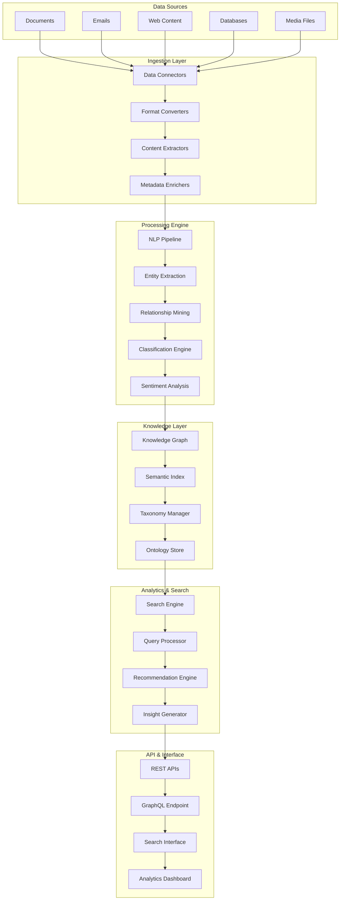

# Technical Architecture: Knowledge Mining Design Pattern

## Architecture Overview

The Knowledge Mining Design Pattern implements an intelligent system for extracting, processing, and surfacing insights from unstructured data sources. This architecture combines advanced AI/ML capabilities with scalable data processing to transform raw information into actionable knowledge.

### Key Architectural Principles
- **Scalable Ingestion**: Handle diverse data sources and formats at enterprise scale
- **Intelligent Processing**: Apply AI/ML models for content understanding and extraction
- **Knowledge Graph Construction**: Build interconnected knowledge representations
- **Real-time Analytics**: Provide immediate insights and search capabilities
- **Semantic Understanding**: Enable natural language queries and contextual search

## System Architecture Diagram



## Component Architecture Details

### Data Ingestion Components

**Data Connectors**
- Multi-protocol support (HTTP, FTP, SFTP, Database connections)
- Real-time and batch ingestion capabilities
- Change detection and incremental updates
- Error handling and retry mechanisms

**Content Extractors**
- OCR for image-based documents
- Text extraction from various file formats
- Metadata preservation and enhancement
- Content validation and quality checks

### Processing Engine Components

**NLP Pipeline**
- Language detection and processing
- Tokenization and normalization
- Named entity recognition (NER)
- Part-of-speech tagging
- Dependency parsing

**Entity Extraction Engine**
- Custom entity models
- Pre-trained model integration
- Confidence scoring
- Entity linking and resolution

**Relationship Mining**
- Co-occurrence analysis
- Semantic relationship detection
- Temporal relationship extraction
- Causal relationship identification

### Knowledge Management Components

**Knowledge Graph Engine**
- Graph database integration (Neo4j, Amazon Neptune)
- Schema management and evolution
- Entity deduplication and merging
- Relationship validation and scoring

**Semantic Index**
- Vector embeddings storage
- Similarity search capabilities
- Multi-modal indexing support
- Real-time index updates

## Data Flow Architecture

### Ingestion Flow
```
Raw Data → Format Detection → Content Extraction → Metadata Enrichment → Quality Validation → Processing Queue
```

### Processing Flow
```
Queued Content → NLP Analysis → Entity Extraction → Relationship Mining → Knowledge Graph Update → Index Refresh
```

### Query Flow
```
User Query → Query Analysis → Intent Recognition → Knowledge Graph Search → Result Ranking → Response Generation
```

### Analytics Flow
```
Knowledge Graph → Pattern Detection → Insight Generation → Trend Analysis → Recommendation Creation → Dashboard Update
```

## Security Architecture

### Data Protection
- Encryption at rest and in transit (AES-256)
- Field-level encryption for sensitive data
- Data masking and anonymization capabilities
- Secure key management (AWS KMS, Azure Key Vault)

### Access Control
- Role-based access control (RBAC)
- Attribute-based access control (ABAC)
- API authentication and authorization
- Content-level security policies

### Privacy & Compliance
- GDPR compliance features
- Data lineage tracking
- Audit logging and monitoring
- Right to be forgotten implementation

### Security Monitoring
- Anomaly detection for data access
- Security event correlation
- Threat intelligence integration
- Automated incident response

## Performance & Scalability

### Horizontal Scaling
- Microservices architecture
- Container orchestration (Kubernetes)
- Auto-scaling based on workload
- Load balancing across services

### Data Processing Optimization
- Parallel processing pipelines
- Distributed computing (Apache Spark)
- Caching strategies (Redis, Memcached)
- Batch and stream processing optimization

### Storage Optimization
- Tiered storage strategies
- Data compression and deduplication
- Archival policies
- Index optimization

### Query Performance
- Query optimization and caching
- Materialized views
- Pre-computed aggregations
- Result pagination and streaming

## Monitoring & Observability

### Application Monitoring
- Service health checks
- Performance metrics collection
- Error rate monitoring
- Resource utilization tracking

### Data Quality Monitoring
- Content processing success rates
- Entity extraction accuracy
- Knowledge graph consistency
- Data freshness metrics

### Business Metrics
- Knowledge discovery rates
- User engagement analytics
- Search effectiveness metrics
- Insight generation performance

### Alerting & Notifications
- Real-time alert system
- Escalation procedures
- Integration with incident management
- Automated remediation triggers

## Disaster Recovery & Business Continuity

### Backup Strategy
- Automated daily backups
- Cross-region replication
- Point-in-time recovery
- Backup validation and testing

### High Availability
- Multi-region deployment
- Active-passive failover
- Database clustering
- Service redundancy

### Recovery Procedures
- RTO: 4 hours for critical services
- RPO: 1 hour for data loss
- Automated failover mechanisms
- Regular disaster recovery testing

### Data Integrity
- Checksums and validation
- Transaction logging
- Consistency checks
- Corruption detection and repair

## Integration Patterns

### API Integration
- RESTful API design
- GraphQL for flexible queries
- Webhook support for real-time updates
- Rate limiting and throttling

### Event-Driven Architecture
- Event sourcing patterns
- Message queuing (Apache Kafka)
- Event streaming and processing
- Saga pattern for distributed transactions

### Third-Party Integrations
- CRM system connectors
- Business intelligence tools
- Content management systems
- External data providers

### Data Exchange
- Standard format support (JSON, XML, CSV)
- Schema registry and validation
- Data transformation pipelines
- API versioning strategies

## Deployment Architecture

### Infrastructure Components
- Container orchestration platform
- Service mesh for communication
- API gateway for external access
- Load balancers and CDN

### Environment Strategy
- Development, staging, production environments
- Infrastructure as Code (Terraform)
- Automated deployment pipelines
- Blue-green deployment strategy

### Configuration Management
- Environment-specific configurations
- Secret management systems
- Feature flags and toggles
- Dynamic configuration updates

### Monitoring & Logging
- Centralized logging (ELK Stack)
- Distributed tracing (Jaeger)
- Metrics collection (Prometheus)
- Alerting and notification systems

## Cost Optimization

### Resource Management
- Right-sizing compute resources
- Spot instance utilization
- Reserved capacity planning
- Auto-scaling optimization

### Storage Optimization
- Intelligent tiering strategies
- Data lifecycle management
- Compression and deduplication
- Archive and deletion policies

### Processing Efficiency
- Batch processing optimization
- Caching strategies
- Query optimization
- Resource pooling

### Monitoring & Analytics
- Cost tracking and allocation
- Usage pattern analysis
- Optimization recommendations
- Budget alerts and controls

## Technology Stack Recommendations

### Core Technologies
- **Processing**: Apache Spark, Apache Flink
- **Storage**: Elasticsearch, Neo4j, PostgreSQL
- **ML/AI**: TensorFlow, PyTorch, spaCy, Transformers
- **Search**: Elasticsearch, Apache Solr
- **Messaging**: Apache Kafka, RabbitMQ

### Cloud Services
- **AWS**: Comprehend, Kendra, Neptune, SageMaker
- **Azure**: Cognitive Search, Text Analytics, Cosmos DB
- **GCP**: Natural Language AI, Vertex AI, Cloud Search

### Development Tools
- **Languages**: Python, Java, Scala
- **Frameworks**: Spring Boot, FastAPI, Django
- **Containers**: Docker, Kubernetes
- **CI/CD**: Jenkins, GitLab CI, GitHub Actions