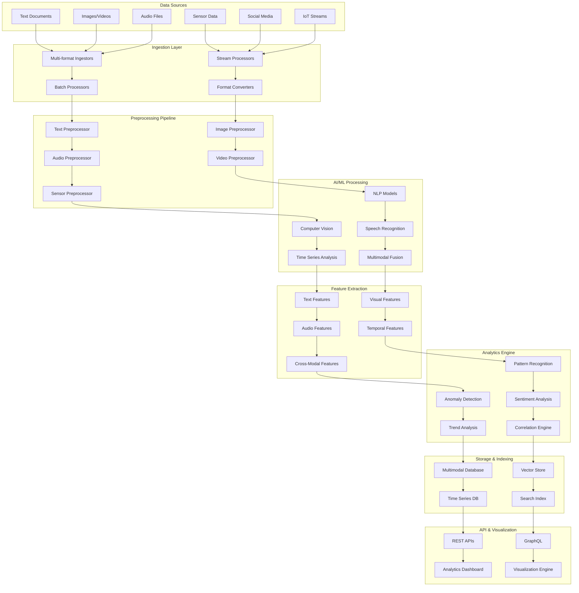

# Technical Architecture: Multimodal Analytics Design Pattern

## Architecture Overview

The Multimodal Analytics Design Pattern implements a comprehensive system for processing, analyzing, and extracting insights from multiple data modalities including text, images, audio, video, and sensor data. This architecture combines advanced AI/ML models with scalable data processing to provide unified analytics across diverse data types.

### Key Architectural Principles
- **Unified Data Processing**: Handle multiple data modalities in a single platform
- **Cross-Modal Intelligence**: Extract insights from relationships between different data types
- **Scalable Processing**: Handle large volumes of multimodal data efficiently
- **Real-time Analytics**: Provide immediate insights across all data modalities
- **Semantic Understanding**: Enable contextual analysis across different data formats

## System Architecture Diagram



## Component Architecture Details

### Data Ingestion Components

**Multi-format Ingestors**
- Support for 50+ file formats
- Real-time streaming capabilities
- Batch processing for large datasets
- Metadata extraction and preservation

**Stream Processors**
- Apache Kafka for high-throughput streaming
- Real-time data validation
- Schema evolution support
- Backpressure handling

**Format Converters**
- Automatic format detection
- Standardized internal representations
- Quality validation and enhancement
- Compression and optimization

### Preprocessing Pipeline Components

**Text Preprocessor**
- Language detection and normalization
- Tokenization and cleaning
- OCR for image-based text
- Document structure analysis

**Image/Video Preprocessor**
- Format standardization
- Resolution optimization
- Frame extraction from videos
- Quality enhancement algorithms

**Audio Preprocessor**
- Format conversion and normalization
- Noise reduction and enhancement
- Feature extraction preparation
- Segmentation and chunking

**Sensor Data Preprocessor**
- Time series alignment
- Outlier detection and cleaning
- Interpolation for missing values
- Normalization and scaling

### AI/ML Processing Components

**Natural Language Processing**
- Transformer-based language models
- Named entity recognition
- Sentiment and emotion analysis
- Topic modeling and classification

**Computer Vision**
- Object detection and recognition
- Scene understanding
- Facial recognition and analysis
- Activity recognition in videos

**Speech Recognition & Analysis**
- Automatic speech recognition (ASR)
- Speaker identification
- Emotion detection from voice
- Audio event classification

**Multimodal Fusion**
- Cross-modal attention mechanisms
- Joint embedding spaces
- Multimodal transformers
- Fusion strategy optimization

## Data Flow Architecture

### Ingestion Flow
```
Raw Data → Format Detection → Preprocessing → Quality Validation → Storage → Processing Queue
```

### Processing Flow
```
Queued Data → Modality-Specific Processing → Feature Extraction → Cross-Modal Analysis → Insight Generation
```

### Analytics Flow
```
Processed Features → Pattern Recognition → Correlation Analysis → Trend Detection → Insight Synthesis → Visualization
```

### Query Flow
```
User Query → Intent Analysis → Multi-Modal Search → Result Fusion → Ranking → Response Generation
```

## Security Architecture

### Data Protection
- End-to-end encryption for all data types
- Format-specific security measures
- Secure multimodal data transmission
- Privacy-preserving analytics techniques

### Access Control
- Granular permissions by data modality
- Content-based access controls
- API authentication and rate limiting
- Audit logging for all access

### Privacy & Compliance
- GDPR compliance for multimodal data
- Biometric data protection
- Data anonymization techniques
- Right to erasure implementation

### Model Security
- Adversarial attack protection
- Model watermarking
- Secure model serving
- Privacy-preserving ML techniques

## Performance & Scalability

### Horizontal Scaling
- Microservices for each modality
- Container orchestration
- Auto-scaling based on data type
- Load balancing across processing nodes

### Processing Optimization
- GPU acceleration for ML workloads
- Parallel processing pipelines
- Caching strategies for features
- Batch optimization techniques

### Storage Optimization
- Tiered storage by data type
- Compression algorithms
- Data deduplication
- Intelligent archival policies

### Query Performance
- Multi-modal indexing strategies
- Query optimization techniques
- Result caching and materialization
- Progressive loading for large results

## Monitoring & Observability

### System Monitoring
- Processing pipeline health
- Model performance metrics
- Resource utilization tracking
- Error rate monitoring by modality

### Data Quality Monitoring
- Input data quality metrics
- Processing success rates
- Feature extraction accuracy
- Cross-modal consistency checks

### Model Performance Tracking
- Accuracy metrics by modality
- Inference latency monitoring
- Model drift detection
- A/B testing for model updates

### Business Metrics
- Insight generation rates
- User engagement analytics
- Query response times
- System utilization efficiency

## Disaster Recovery & Business Continuity

### Backup Strategy
- Automated backups by data type
- Cross-region replication
- Incremental backup optimization
- Recovery testing procedures

### High Availability
- Multi-region deployment
- Active-active configuration
- Failover mechanisms
- Data consistency maintenance

### Recovery Procedures
- RTO: 2 hours for critical services
- RPO: 30 minutes for data loss
- Automated recovery processes
- Manual override capabilities

### Data Integrity
- Checksums for all data types
- Cross-modal validation
- Consistency verification
- Corruption detection and repair

## Integration Patterns

### API Integration
- RESTful APIs for each modality
- GraphQL for complex queries
- WebSocket for real-time updates
- Batch API for large datasets

### Event-Driven Architecture
- Event streaming for real-time processing
- Message queuing for batch jobs
- Event sourcing for audit trails
- Saga patterns for complex workflows

### Third-Party Integrations
- Cloud AI service connectors
- Business intelligence tools
- Content management systems
- Social media platform APIs

### Data Exchange
- Standard format support
- Schema registry and validation
- Data transformation pipelines
- API versioning strategies

## Deployment Architecture

### Infrastructure Components
- Kubernetes for orchestration
- Service mesh for communication
- API gateway for external access
- CDN for content delivery

### Environment Strategy
- Multi-environment deployment
- Infrastructure as Code
- Automated deployment pipelines
- Canary deployment strategies

### Configuration Management
- Environment-specific configs
- Secret management systems
- Feature flags and toggles
- Dynamic configuration updates

### Monitoring & Logging
- Centralized logging (ELK Stack)
- Distributed tracing
- Metrics collection (Prometheus)
- Alerting and notification systems

## Cost Optimization

### Resource Management
- Right-sizing compute resources
- GPU utilization optimization
- Spot instance strategies
- Reserved capacity planning

### Storage Optimization
- Intelligent data tiering
- Compression and deduplication
- Lifecycle management policies
- Cost-effective archival strategies

### Processing Efficiency
- Batch processing optimization
- Model inference optimization
- Caching strategies
- Resource pooling

### Monitoring & Analytics
- Cost tracking by modality
- Usage pattern analysis
- Optimization recommendations
- Budget alerts and controls

## Technology Stack Recommendations

### Core Technologies
- **Processing**: Apache Spark, Apache Flink, Ray
- **Storage**: Elasticsearch, MongoDB, InfluxDB, MinIO
- **ML/AI**: TensorFlow, PyTorch, Hugging Face Transformers
- **Search**: Elasticsearch, Weaviate, Pinecone
- **Streaming**: Apache Kafka, Apache Pulsar

### Cloud Services
- **AWS**: Rekognition, Comprehend, Transcribe, SageMaker
- **Azure**: Cognitive Services, Machine Learning, Cosmos DB
- **GCP**: Vision AI, Natural Language AI, Speech-to-Text, Vertex AI

### Specialized Tools
- **Computer Vision**: OpenCV, YOLO, MediaPipe
- **NLP**: spaCy, NLTK, Transformers
- **Audio**: librosa, PyAudio, SpeechRecognition
- **Visualization**: D3.js, Plotly, Grafana

### Development Tools
- **Languages**: Python, Java, JavaScript, Go
- **Frameworks**: FastAPI, Spring Boot, React, Vue.js
- **Containers**: Docker, Kubernetes
- **CI/CD**: Jenkins, GitLab CI, GitHub Actions

## Implementation Considerations

### Data Quality Management
- Quality metrics by modality
- Automated quality checks
- Data validation pipelines
- Quality improvement workflows

### Model Management
- Model versioning and deployment
- A/B testing frameworks
- Model monitoring and alerting
- Automated retraining pipelines

### Scalability Planning
- Capacity planning by data type
- Performance benchmarking
- Load testing strategies
- Scaling automation

### User Experience
- Intuitive multimodal interfaces
- Progressive loading strategies
- Responsive design principles
- Accessibility considerations