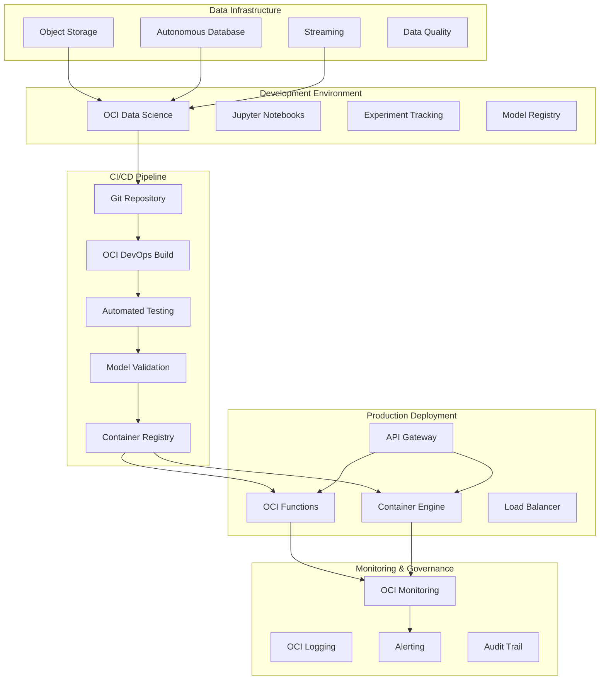

# Technical Architecture: AI Model Lifecycle Management (MLOps)

## Architecture Overview

The AI Model Lifecycle Management solution provides end-to-end MLOps capabilities leveraging Oracle Cloud Infrastructure services. This architecture enables automated model development, deployment, monitoring, and governance at enterprise scale.



## Core Architecture Components

### 1. Model Development Layer

#### OCI Data Science Platform
- **Purpose**: Centralized ML development environment
- **Components**:
  - Managed Jupyter notebooks with pre-configured ML frameworks
  - Scalable compute instances (CPU, GPU, HPC shapes)
  - Integrated development environment for data scientists
  - Built-in collaboration and version control

#### Model Registry
- **Purpose**: Centralized model artifact management
- **Features**:
  - Model versioning and lineage tracking
  - Metadata management and tagging
  - Model approval workflows
  - Integration with CI/CD pipelines

#### Experiment Tracking
- **Purpose**: ML experiment management and reproducibility
- **Capabilities**:
  - Parameter and metric tracking
  - Artifact storage and comparison
  - Experiment visualization and analysis
  - Team collaboration features

### 2. CI/CD Pipeline Layer

#### Source Control Integration
```yaml
# .oci/build_spec.yaml
version: 0.1
component: build
timeoutInSeconds: 6000
shell: bash

env:
  variables:
    PYTHON_VERSION: "3.9"
    MODEL_VERSION: "${OCI_BUILD_RUN_ID}"

steps:
  - type: Command
    name: "Setup Environment"
    command: |
      python -m pip install --upgrade pip
      pip install -r requirements.txt
      
  - type: Command
    name: "Run Tests"
    command: |
      python -m pytest tests/ -v --junitxml=test-results.xml
      
  - type: Command
    name: "Model Validation"
    command: |
      python scripts/validate_model.py --model-path models/
      
  - type: Command
    name: "Build Container"
    command: |
      docker build -t model-service:${MODEL_VERSION} .
      
  - type: Command
    name: "Push to Registry"
    command: |
      docker tag model-service:${MODEL_VERSION} ${OCIR_REGION}.ocir.io/${TENANCY_NAMESPACE}/model-service:${MODEL_VERSION}
      docker push ${OCIR_REGION}.ocir.io/${TENANCY_NAMESPACE}/model-service:${MODEL_VERSION}

outputArtifacts:
  - name: model_container
    type: DOCKER_IMAGE
    location: ${OCIR_REGION}.ocir.io/${TENANCY_NAMESPACE}/model-service:${MODEL_VERSION}
```

#### Automated Testing Framework
- **Unit Tests**: Model logic and data processing functions
- **Integration Tests**: End-to-end pipeline validation
- **Performance Tests**: Latency and throughput benchmarks
- **Data Quality Tests**: Input validation and schema compliance

### 3. Deployment Layer

#### Serverless Model Serving (OCI Functions)
```python
# model_serving_function.py
import json
import oci
import joblib
import numpy as np
from fdk import response

def handler(ctx, data: io.BytesIO = None):
    """
    Serverless model inference function
    """
    try:
        # Parse input data
        request_data = json.loads(data.getvalue())
        features = np.array(request_data['features']).reshape(1, -1)
        
        # Load model from Object Storage
        model = load_model_from_storage()
        
        # Make prediction
        prediction = model.predict(features)
        confidence = model.predict_proba(features).max()
        
        # Log prediction for monitoring
        log_prediction(request_data, prediction, confidence)
        
        return response.Response(
            ctx, 
            response_data=json.dumps({
                'prediction': prediction.tolist(),
                'confidence': float(confidence),
                'model_version': get_model_version(),
                'timestamp': datetime.utcnow().isoformat()
            }),
            headers={"Content-Type": "application/json"}
        )
        
    except Exception as e:
        return response.Response(
            ctx,
            response_data=json.dumps({'error': str(e)}),
            status_code=500
        )
```

#### Container-based Deployment (OKE)
```yaml
# kubernetes-deployment.yaml
apiVersion: apps/v1
kind: Deployment
metadata:
  name: model-service
  labels:
    app: model-service
spec:
  replicas: 3
  selector:
    matchLabels:
      app: model-service
  template:
    metadata:
      labels:
        app: model-service
    spec:
      containers:
      - name: model-service
        image: ${OCIR_REGION}.ocir.io/${TENANCY_NAMESPACE}/model-service:${MODEL_VERSION}
        ports:
        - containerPort: 8080
        env:
        - name: MODEL_VERSION
          value: "${MODEL_VERSION}"
        - name: MONITORING_ENABLED
          value: "true"
        resources:
          requests:
            memory: "1Gi"
            cpu: "500m"
          limits:
            memory: "2Gi"
            cpu: "1000m"
        livenessProbe:
          httpGet:
            path: /health
            port: 8080
          initialDelaySeconds: 30
          periodSeconds: 10
        readinessProbe:
          httpGet:
            path: /ready
            port: 8080
          initialDelaySeconds: 5
          periodSeconds: 5
---
apiVersion: v1
kind: Service
metadata:
  name: model-service
spec:
  selector:
    app: model-service
  ports:
  - protocol: TCP
    port: 80
    targetPort: 8080
  type: LoadBalancer
```

### 4. Monitoring and Observability Layer

#### Model Performance Monitoring
```python
# monitoring/model_monitor.py
import oci
import numpy as np
from typing import Dict, Any
import logging

class ModelMonitor:
    def __init__(self, monitoring_client, compartment_id):
        self.monitoring_client = monitoring_client
        self.compartment_id = compartment_id
        self.logger = logging.getLogger(__name__)
    
    def track_prediction(self, model_id: str, features: np.ndarray, 
                        prediction: Any, confidence: float):
        """Track individual predictions for drift detection"""
        
        # Calculate feature statistics
        feature_stats = {
            'mean': float(np.mean(features)),
            'std': float(np.std(features)),
            'min': float(np.min(features)),
            'max': float(np.max(features))
        }
        
        # Emit custom metrics
        self._emit_metrics(model_id, {
            'prediction_confidence': confidence,
            'feature_mean': feature_stats['mean'],
            'feature_std': feature_stats['std']
        })
        
        # Store for batch analysis
        self._store_prediction_data(model_id, features, prediction, confidence)
    
    def detect_drift(self, model_id: str, reference_data: np.ndarray, 
                    current_data: np.ndarray) -> Dict[str, Any]:
        """Detect data drift using statistical tests"""
        
        from scipy import stats
        
        drift_results = {}
        
        # KS test for distribution drift
        ks_statistic, ks_p_value = stats.ks_2samp(
            reference_data.flatten(), 
            current_data.flatten()
        )
        
        drift_results['ks_test'] = {
            'statistic': ks_statistic,
            'p_value': ks_p_value,
            'drift_detected': ks_p_value < 0.05
        }
        
        # Feature-wise drift analysis
        if reference_data.ndim > 1:
            feature_drift = []
            for i in range(reference_data.shape[1]):
                ref_feature = reference_data[:, i]
                cur_feature = current_data[:, i]
                
                ks_stat, ks_p = stats.ks_2samp(ref_feature, cur_feature)
                feature_drift.append({
                    'feature_index': i,
                    'ks_statistic': ks_stat,
                    'ks_p_value': ks_p,
                    'drift_detected': ks_p < 0.05
                })
            
            drift_results['feature_drift'] = feature_drift
        
        # Emit drift metrics
        self._emit_drift_metrics(model_id, drift_results)
        
        return drift_results
    
    def _emit_metrics(self, model_id: str, metrics: Dict[str, float]):
        """Emit custom metrics to OCI Monitoring"""
        
        metric_data = []
        for metric_name, value in metrics.items():
            metric_data.append({
                'namespace': 'ml_models',
                'name': metric_name,
                'dimensions': {'model_id': model_id},
                'value': value,
                'timestamp': datetime.utcnow()
            })
        
        try:
            self.monitoring_client.post_metric_data(
                post_metric_data_details=oci.monitoring.models.PostMetricDataDetails(
                    metric_data=metric_data
                )
            )
        except Exception as e:
            self.logger.error(f"Failed to emit metrics: {e}")
```

#### Alerting Configuration
```yaml
# monitoring/alerting-rules.yaml
apiVersion: monitoring.oci.oracle.com/v1
kind: AlertRule
metadata:
  name: model-drift-alert
spec:
  displayName: "Model Drift Detection"
  compartmentId: "${COMPARTMENT_ID}"
  isEnabled: true
  condition: |
    ml_models[1m]{model_id}.drift_score > 0.8
  severity: "CRITICAL"
  destinations:
    - "${ONS_TOPIC_ID}"
  metricCompartmentId: "${COMPARTMENT_ID}"
  repeatNotificationDuration: "PT30M"

---
apiVersion: monitoring.oci.oracle.com/v1
kind: AlertRule
metadata:
  name: model-latency-alert
spec:
  displayName: "Model Inference Latency"
  compartmentId: "${COMPARTMENT_ID}"
  isEnabled: true
  condition: |
    ml_models[5m]{model_id}.inference_latency > 1000
  severity: "WARNING"
  destinations:
    - "${ONS_TOPIC_ID}"
  metricCompartmentId: "${COMPARTMENT_ID}"
  repeatNotificationDuration: "PT15M"
```

### 5. Data Infrastructure Layer

#### Feature Store Architecture
```python
# feature_store/feature_manager.py
import oci
import pandas as pd
from typing import List, Dict, Any
import logging

class FeatureStore:
    def __init__(self, autonomous_db_client, object_storage_client):
        self.db_client = autonomous_db_client
        self.storage_client = object_storage_client
        self.logger = logging.getLogger(__name__)
    
    def register_feature_group(self, name: str, features: List[str], 
                              description: str, tags: Dict[str, str] = None):
        """Register a new feature group"""
        
        feature_group = {
            'name': name,
            'features': features,
            'description': description,
            'tags': tags or {},
            'created_at': datetime.utcnow(),
            'status': 'active'
        }
        
        # Store metadata in database
        self._store_feature_group_metadata(feature_group)
        
        return feature_group
    
    def compute_features(self, feature_group_name: str, 
                        entity_ids: List[str]) -> pd.DataFrame:
        """Compute features for given entities"""
        
        # Retrieve feature group configuration
        config = self._get_feature_group_config(feature_group_name)
        
        # Execute feature computation pipeline
        features_df = self._execute_feature_pipeline(config, entity_ids)
        
        # Store computed features
        self._store_features(feature_group_name, features_df)
        
        return features_df
    
    def get_features(self, feature_group_name: str, 
                    entity_ids: List[str], 
                    point_in_time: datetime = None) -> pd.DataFrame:
        """Retrieve features for model inference"""
        
        if point_in_time:
            # Point-in-time lookup for training data
            return self._get_historical_features(
                feature_group_name, entity_ids, point_in_time
            )
        else:
            # Real-time lookup for inference
            return self._get_online_features(feature_group_name, entity_ids)
```

### 6. Security and Governance Layer

#### Model Governance Framework
```python
# governance/model_governance.py
import oci
from typing import Dict, Any, List
import logging

class ModelGovernance:
    def __init__(self, vault_client, audit_client):
        self.vault_client = vault_client
        self.audit_client = audit_client
        self.logger = logging.getLogger(__name__)
    
    def register_model(self, model_metadata: Dict[str, Any]) -> str:
        """Register model with governance tracking"""
        
        # Validate required metadata
        required_fields = [
            'name', 'version', 'algorithm', 'training_data', 
            'performance_metrics', 'business_purpose', 'owner'
        ]
        
        for field in required_fields:
            if field not in model_metadata:
                raise ValueError(f"Required field '{field}' missing")
        
        # Generate model ID
        model_id = f"{model_metadata['name']}-{model_metadata['version']}"
        
        # Store governance metadata
        governance_record = {
            'model_id': model_id,
            'metadata': model_metadata,
            'registration_date': datetime.utcnow(),
            'status': 'registered',
            'approvals': [],
            'audit_trail': []
        }
        
        self._store_governance_record(governance_record)
        self._log_audit_event('MODEL_REGISTERED', model_id, model_metadata)
        
        return model_id
    
    def request_approval(self, model_id: str, approver: str, 
                        approval_type: str) -> str:
        """Request model approval for deployment"""
        
        approval_request = {
            'model_id': model_id,
            'approver': approver,
            'approval_type': approval_type,
            'status': 'pending',
            'requested_at': datetime.utcnow(),
            'request_id': generate_uuid()
        }
        
        self._store_approval_request(approval_request)
        self._send_approval_notification(approval_request)
        
        return approval_request['request_id']
    
    def approve_model(self, request_id: str, approver: str, 
                     decision: str, comments: str = None):
        """Approve or reject model deployment"""
        
        approval = {
            'request_id': request_id,
            'approver': approver,
            'decision': decision,  # 'approved' or 'rejected'
            'comments': comments,
            'approved_at': datetime.utcnow()
        }
        
        self._store_approval_decision(approval)
        self._log_audit_event('MODEL_APPROVAL', request_id, approval)
        
        if decision == 'approved':
            self._update_model_status(request_id, 'approved')
        else:
            self._update_model_status(request_id, 'rejected')
```

## Deployment Patterns

### 1. Blue-Green Deployment
```python
# deployment/blue_green.py
class BlueGreenDeployment:
    def __init__(self, oke_client, load_balancer_client):
        self.oke_client = oke_client
        self.lb_client = load_balancer_client
    
    def deploy_new_version(self, model_version: str, 
                          validation_percentage: float = 0.1):
        """Deploy new model version using blue-green strategy"""
        
        # Deploy to green environment
        green_deployment = self._deploy_to_green(model_version)
        
        # Run validation tests
        if self._validate_deployment(green_deployment, validation_percentage):
            # Switch traffic to green
            self._switch_traffic_to_green()
            # Cleanup blue environment
            self._cleanup_blue_environment()
        else:
            # Rollback to blue
            self._rollback_to_blue()
            raise Exception("Deployment validation failed")
```

### 2. Canary Deployment
```python
# deployment/canary.py
class CanaryDeployment:
    def __init__(self, api_gateway_client, monitoring_client):
        self.gateway_client = api_gateway_client
        self.monitoring_client = monitoring_client
    
    def deploy_canary(self, model_version: str, traffic_percentage: float):
        """Deploy model version to subset of traffic"""
        
        # Update API Gateway routing rules
        self._update_routing_rules(model_version, traffic_percentage)
        
        # Monitor canary performance
        canary_metrics = self._monitor_canary_performance(model_version)
        
        if self._is_canary_healthy(canary_metrics):
            return True
        else:
            self._rollback_canary()
            return False
```

## Performance Optimization

### Model Optimization Strategies
```python
# optimization/model_optimizer.py
class ModelOptimizer:
    def __init__(self):
        self.optimization_strategies = {
            'quantization': self._apply_quantization,
            'pruning': self._apply_pruning,
            'distillation': self._apply_distillation,
            'onnx_conversion': self._convert_to_onnx
        }
    
    def optimize_model(self, model, strategy: str, **kwargs):
        """Apply optimization strategy to model"""
        
        if strategy not in self.optimization_strategies:
            raise ValueError(f"Unknown optimization strategy: {strategy}")
        
        return self.optimization_strategies[strategy](model, **kwargs)
    
    def benchmark_model(self, model, test_data, iterations: int = 100):
        """Benchmark model performance"""
        
        latencies = []
        
        for _ in range(iterations):
            start_time = time.time()
            _ = model.predict(test_data)
            latencies.append(time.time() - start_time)
        
        return {
            'mean_latency': np.mean(latencies),
            'p95_latency': np.percentile(latencies, 95),
            'p99_latency': np.percentile(latencies, 99),
            'throughput': len(test_data) / np.mean(latencies)
        }
```

## Cost Optimization

### Resource Management
```python
# cost_optimization/resource_manager.py
class ResourceManager:
    def __init__(self, compute_client, monitoring_client):
        self.compute_client = compute_client
        self.monitoring_client = monitoring_client
    
    def optimize_compute_resources(self, deployment_id: str):
        """Optimize compute resources based on usage patterns"""
        
        # Analyze usage metrics
        usage_metrics = self._get_usage_metrics(deployment_id)
        
        # Recommend optimal instance shapes
        recommendations = self._generate_shape_recommendations(usage_metrics)
        
        # Auto-scale based on load
        if usage_metrics['cpu_utilization'] > 80:
            self._scale_up(deployment_id)
        elif usage_metrics['cpu_utilization'] < 20:
            self._scale_down(deployment_id)
        
        return recommendations
```

## Integration Patterns

### External System Integration
```python
# integration/external_systems.py
class ExternalSystemIntegrator:
    def __init__(self, api_gateway_client):
        self.gateway_client = api_gateway_client
    
    def setup_webhook_integration(self, system_name: str, 
                                 webhook_url: str, events: List[str]):
        """Setup webhook integration for external systems"""
        
        webhook_config = {
            'system_name': system_name,
            'webhook_url': webhook_url,
            'events': events,
            'retry_policy': {
                'max_retries': 3,
                'backoff_strategy': 'exponential'
            }
        }
        
        return self._register_webhook(webhook_config)
```

This technical architecture provides a comprehensive foundation for implementing enterprise-scale MLOps capabilities using Oracle Cloud Infrastructure services. The modular design allows for gradual adoption and customization based on specific organizational requirements.