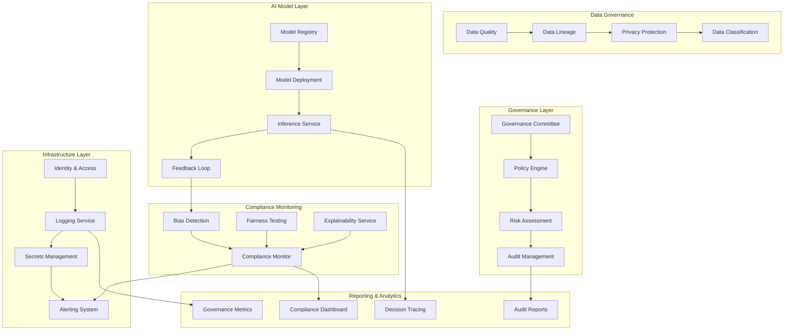

# Technical Architecture: AI Governance & Compliance Framework

## Architecture Overview

The AI Governance & Compliance Framework provides comprehensive oversight, risk management, and regulatory compliance capabilities for enterprise AI systems. This architecture ensures responsible AI deployment while maintaining business agility and innovation.



## Core Architecture Components

### 1. Governance Management Layer

#### AI Governance Committee Portal
```yaml
# Governance Committee Configuration
governance:
  committee:
    chairperson: "Chief Risk Officer"
    members:
      - role: "Chief Data Officer"
        permissions: ["policy_approval", "risk_review"]
      - role: "Legal Counsel"
        permissions: ["compliance_review", "policy_approval"]
      - role: "Chief Technology Officer"
        permissions: ["technical_review", "implementation_approval"]
      - role: "Ethics Officer"
        permissions: ["ethics_review", "bias_assessment"]
      - role: "Business Representative"
        permissions: ["business_impact_review"]
  
  meeting_schedule:
    frequency: "monthly"
    ad_hoc_triggers:
      - "high_risk_model_deployment"
      - "compliance_violation"
      - "regulatory_change"
  
  decision_thresholds:
    automatic_approval:
      risk_score: "< 3"
      business_impact: "low"
    committee_review:
      risk_score: ">= 3"
      protected_attributes: "true"
    executive_approval:
      risk_score: ">= 7"
      financial_impact: "> $1M"
```

#### Policy Engine
```yaml
# AI Ethics and Governance Policies
policies:
  ethical_principles:
    - principle: "Fairness"
      description: "AI systems must treat all individuals and groups equitably"
      implementation:
        - bias_testing_required: true
        - protected_attributes: ["race", "gender", "age", "religion"]
        - fairness_metrics: ["demographic_parity", "equalized_odds"]
    
    - principle: "Transparency"
      description: "AI decision-making processes must be explainable"
      implementation:
        - explanation_required: true
        - documentation_standards: "comprehensive"
        - stakeholder_communication: "clear"
    
    - principle: "Accountability"
      description: "Clear responsibility for AI system outcomes"
      implementation:
        - ownership_assignment: "mandatory"
        - audit_trail: "complete"
        - remediation_process: "defined"
    
    - principle: "Privacy"
      description: "Personal data protection and privacy by design"
      implementation:
        - data_minimization: true
        - consent_management: "explicit"
        - retention_limits: "enforced"
  
  prohibited_use_cases:
    - "Social credit scoring"
    - "Mass surveillance"
    - "Predictive policing without human oversight"
    - "Automated hiring without bias testing"
  
  risk_classification:
    low_risk:
      criteria: ["no_human_impact", "reversible_decisions"]
      requirements: ["basic_documentation", "annual_review"]
    
    medium_risk:
      criteria: ["moderate_human_impact", "business_decisions"]
      requirements: ["bias_testing", "quarterly_review", "explainability"]
    
    high_risk:
      criteria: ["significant_human_impact", "protected_attributes"]
      requirements: ["comprehensive_testing", "monthly_review", "human_oversight"]
    
    critical_risk:
      criteria: ["life_safety", "fundamental_rights"]
      requirements: ["extensive_validation", "continuous_monitoring", "expert_review"]
```

#### Risk Assessment Framework
```yaml
# AI Risk Assessment Configuration
risk_assessment:
  scoring_methodology:
    factors:
      - name: "Human Impact"
        weight: 0.3
        scale: 1-10
        criteria:
          1: "No direct human impact"
          5: "Moderate impact on individual outcomes"
          10: "Significant impact on fundamental rights"
      
      - name: "Data Sensitivity"
        weight: 0.25
        scale: 1-10
        criteria:
          1: "Public or anonymized data"
          5: "Personal but non-sensitive data"
          10: "Special category personal data"
      
      - name: "Decision Autonomy"
        weight: 0.2
        scale: 1-10
        criteria:
          1: "Human-in-the-loop for all decisions"
          5: "Human oversight with intervention capability"
          10: "Fully automated decision-making"
      
      - name: "Scale and Reach"
        weight: 0.15
        scale: 1-10
        criteria:
          1: "Limited internal use"
          5: "Moderate customer impact"
          10: "Large-scale public deployment"
      
      - name: "Regulatory Environment"
        weight: 0.1
        scale: 1-10
        criteria:
          1: "No specific regulations"
          5: "General data protection laws"
          10: "Strict AI-specific regulations"
  
  risk_triggers:
    immediate_review:
      - "bias_detection_threshold_exceeded"
      - "accuracy_degradation > 5%"
      - "compliance_violation_detected"
    
    escalation_criteria:
      - risk_score: "> 7"
      - regulatory_inquiry: true
      - public_concern: "high"
  
  mitigation_strategies:
    technical:
      - "Enhanced bias testing"
      - "Increased model interpretability"
      - "Additional validation datasets"
      - "Human oversight integration"
    
    process:
      - "Enhanced review procedures"
      - "Stakeholder consultation"
      - "External expert review"
      - "Phased deployment approach"
```

### 2. Compliance Monitoring Layer

#### Bias Detection and Fairness Testing
```yaml
# Bias Detection Configuration
bias_detection:
  protected_attributes:
    - name: "race"
      categories: ["white", "black", "asian", "hispanic", "other"]
      fairness_metrics: ["demographic_parity", "equalized_odds"]
    
    - name: "gender"
      categories: ["male", "female", "non_binary"]
      fairness_metrics: ["demographic_parity", "equal_opportunity"]
    
    - name: "age"
      categories: ["18-30", "31-45", "46-60", "60+"]
      fairness_metrics: ["demographic_parity"]
  
  fairness_metrics:
    demographic_parity:
      description: "Equal positive prediction rates across groups"
      threshold: 0.05
      calculation: "abs(P(Y=1|A=a) - P(Y=1|A=b)) <= threshold"
    
    equalized_odds:
      description: "Equal true positive and false positive rates"
      threshold: 0.05
      calculation: "max(TPR_diff, FPR_diff) <= threshold"
    
    equal_opportunity:
      description: "Equal true positive rates across groups"
      threshold: 0.05
      calculation: "abs(TPR_a - TPR_b) <= threshold"
  
  testing_schedule:
    frequency: "weekly"
    triggers:
      - "model_deployment"
      - "data_drift_detected"
      - "performance_degradation"
  
  remediation_actions:
    threshold_exceeded:
      - "automatic_alert"
      - "model_quarantine"
      - "stakeholder_notification"
    
    persistent_bias:
      - "model_retraining"
      - "data_augmentation"
      - "algorithmic_intervention"
```

#### Explainability Service
```yaml
# Model Explainability Configuration
explainability:
  explanation_types:
    global:
      methods: ["feature_importance", "partial_dependence"]
      refresh_frequency: "monthly"
      storage_duration: "2_years"
    
    local:
      methods: ["lime", "shap", "counterfactual"]
      generation_trigger: "on_demand"
      cache_duration: "24_hours"
    
    example_based:
      methods: ["prototypes", "nearest_neighbors"]
      update_frequency: "weekly"
      explanation_count: 10
  
  stakeholder_requirements:
    end_users:
      explanation_level: "simple"
      delivery_method: "natural_language"
      response_time: "< 2_seconds"
    
    auditors:
      explanation_level: "detailed"
      delivery_method: "technical_report"
      documentation: "comprehensive"
    
    regulators:
      explanation_level: "comprehensive"
      delivery_method: "formal_documentation"
      legal_language: "required"
  
  quality_metrics:
    faithfulness: 0.8
    stability: 0.9
    comprehensiveness: 0.85
```

### 3. Data Governance Layer

#### Data Quality and Lineage
```yaml
# Data Governance Configuration
data_governance:
  quality_standards:
    completeness:
      threshold: 0.95
      measurement: "non_null_ratio"
      enforcement: "blocking"
    
    accuracy:
      threshold: 0.98
      measurement: "validation_rules"
      enforcement: "warning"
    
    consistency:
      threshold: 0.99
      measurement: "cross_field_validation"
      enforcement: "blocking"
    
    timeliness:
      threshold: "24_hours"
      measurement: "data_freshness"
      enforcement: "warning"
  
  lineage_tracking:
    data_sources:
      - type: "database"
        tracking_level: "table_column"
        retention: "7_years"
      
      - type: "file_system"
        tracking_level: "file"
        retention: "7_years"
      
      - type: "api"
        tracking_level: "endpoint"
        retention: "7_years"
    
    transformation_tracking:
      - preprocessing_steps: "detailed"
      - feature_engineering: "comprehensive"
      - aggregation_logic: "documented"
  
  privacy_protection:
    anonymization:
      techniques: ["k_anonymity", "l_diversity", "t_closeness"]
      minimum_k: 5
      verification: "automated"
    
    encryption:
      at_rest: "AES_256"
      in_transit: "TLS_1_3"
      key_management: "oci_vault"
    
    access_controls:
      principle: "least_privilege"
      review_frequency: "quarterly"
      approval_workflow: "required"
```

### 4. Monitoring and Alerting

#### Compliance Monitoring Dashboard
```yaml
# Monitoring Configuration
monitoring:
  real_time_metrics:
    - name: "bias_score"
      threshold: 0.05
      aggregation: "max"
      alert_severity: "high"
    
    - name: "explanation_availability"
      threshold: 0.95
      aggregation: "avg"
      alert_severity: "medium"
    
    - name: "data_quality_score"
      threshold: 0.95
      aggregation: "min"
      alert_severity: "high"
    
    - name: "audit_completeness"
      threshold: 0.99
      aggregation: "avg"
      alert_severity: "medium"
  
  alert_configurations:
    channels:
      - type: "email"
        recipients: ["governance_team", "model_owners"]
        severity_filter: ["high", "critical"]
      
      - type: "slack"
        channel: "#ai_governance"
        severity_filter: ["medium", "high", "critical"]
      
      - type: "incident_management"
        system: "oci_notifications"
        severity_filter: ["critical"]
    
    escalation:
      - level: 1
        delay: "15_minutes"
        contacts: ["technical_lead"]
      
      - level: 2
        delay: "1_hour"
        contacts: ["governance_committee"]
      
      - level: 3
        delay: "4_hours"
        contacts: ["executive_team"]
  
  dashboard_views:
    executive:
      metrics: ["overall_compliance", "risk_distribution", "trend_analysis"]
      refresh: "daily"
      access: ["c_level", "governance_committee"]
    
    operational:
      metrics: ["real_time_alerts", "model_performance", "bias_monitoring"]
      refresh: "real_time"
      access: ["data_scientists", "ml_engineers"]
    
    audit:
      metrics: ["compliance_evidence", "audit_trails", "documentation_status"]
      refresh: "on_demand"
      access: ["auditors", "compliance_officers"]
```

### 5. Audit and Reporting

#### Audit Trail Management
```yaml
# Audit Configuration
audit:
  logging_requirements:
    model_lifecycle:
      events: ["registration", "deployment", "update", "retirement"]
      retention: "10_years"
      immutability: "required"
    
    decision_tracking:
      events: ["prediction_request", "prediction_response", "explanation_request"]
      retention: "7_years"
      sampling_rate: 1.0
    
    governance_actions:
      events: ["policy_update", "risk_assessment", "approval_decision"]
      retention: "permanent"
      approval_required: true
  
  compliance_reporting:
    regulatory_reports:
      - name: "AI_Impact_Assessment"
        frequency: "annual"
        template: "standard"
        approval_workflow: "governance_committee"
      
      - name: "Bias_Testing_Report"
        frequency: "quarterly"
        template: "technical"
        distribution: "internal"
      
      - name: "Data_Protection_Compliance"
        frequency: "annual"
        template: "legal"
        external_review: "required"
    
    internal_reports:
      - name: "Governance_Dashboard"
        frequency: "monthly"
        audience: "executive_team"
        format: "executive_summary"
      
      - name: "Risk_Assessment_Summary"
        frequency: "quarterly"
        audience: "governance_committee"
        format: "detailed_analysis"
  
  evidence_collection:
    automated:
      - "model_performance_metrics"
      - "bias_testing_results"
      - "data_quality_scores"
      - "explanation_coverage"
    
    manual:
      - "stakeholder_interviews"
      - "process_documentation"
      - "external_assessments"
      - "remediation_actions"
```

## Integration Patterns

### Oracle Cloud Infrastructure Integration
```yaml
# OCI Service Integration
oci_integration:
  data_safe:
    configuration:
      - sensitive_data_discovery: "automated"
      - data_masking: "production_environments"
      - activity_auditing: "comprehensive"
      - risk_assessment: "continuous"
    
    compliance_features:
      - gdpr_reporting: "enabled"
      - data_subject_requests: "automated"
      - breach_detection: "real_time"
  
  identity_access_management:
    governance_roles:
      - name: "AI_Governance_Admin"
        policies: ["manage_governance_policies", "view_all_audit_logs"]
      
      - name: "Model_Owner"
        policies: ["manage_assigned_models", "view_model_metrics"]
      
      - name: "Compliance_Officer"
        policies: ["view_compliance_reports", "manage_risk_assessments"]
      
      - name: "Auditor"
        policies: ["view_audit_trails", "export_compliance_data"]
    
    access_patterns:
      - principle: "least_privilege"
      - mfa_required: true
      - session_monitoring: "enabled"
  
  logging_analytics:
    log_sources:
      - "ai_model_predictions"
      - "governance_policy_evaluations"
      - "bias_detection_results"
      - "explanation_requests"
    
    analysis_rules:
      - "detect_bias_threshold_violations"
      - "identify_anomalous_prediction_patterns"
      - "monitor_compliance_metric_trends"
    
    retention_policies:
      - audit_logs: "10_years"
      - performance_logs: "3_years"
      - debug_logs: "1_year"
  
  vault:
    secret_types:
      - "model_encryption_keys"
      - "api_credentials"
      - "database_connections"
      - "third_party_integrations"
    
    access_controls:
      - rotation_schedule: "quarterly"
      - access_logging: "comprehensive"
      - approval_workflow: "required"
```

### External System Integration
```yaml
# External Integration Points
external_integrations:
  regulatory_intelligence:
    providers: ["Thomson_Reuters", "LexisNexis"]
    update_frequency: "daily"
    alert_types: ["new_regulations", "interpretation_updates"]
  
  bias_detection_tools:
    fairlearn:
      integration_type: "api"
      metrics_supported: ["demographic_parity", "equalized_odds"]
    
    aequitas:
      integration_type: "library"
      bias_audit: "comprehensive"
    
    ai_fairness_360:
      integration_type: "service"
      mitigation_algorithms: "available"
  
  explainability_platforms:
    lime:
      explanation_types: ["tabular", "text", "image"]
      performance_optimization: "enabled"
    
    shap:
      explanation_types: ["tree", "deep", "linear"]
      batch_processing: "supported"
  
  governance_platforms:
    datarobot:
      integration_type: "api"
      features: ["model_registry", "bias_monitoring"]
    
    h2o_ai:
      integration_type: "platform"
      capabilities: ["mlops", "governance"]
```

## Security and Access Control

### Role-Based Access Control (RBAC)
```yaml
# RBAC Configuration for AI Governance
rbac:
  roles:
    ai_governance_administrator:
      permissions:
        - "manage_governance_policies"
        - "configure_compliance_rules"
        - "view_all_audit_logs"
        - "manage_user_access"
      
      responsibilities:
        - "System configuration and maintenance"
        - "Policy definition and updates"
        - "Access control management"
    
    model_owner:
      permissions:
        - "register_models"
        - "update_model_metadata"
        - "view_model_performance"
        - "request_model_deployment"
      
      responsibilities:
        - "Model lifecycle management"
        - "Performance monitoring"
        - "Documentation maintenance"
    
    compliance_officer:
      permissions:
        - "conduct_risk_assessments"
        - "generate_compliance_reports"
        - "investigate_violations"
        - "approve_high_risk_models"
      
      responsibilities:
        - "Regulatory compliance oversight"
        - "Risk assessment and mitigation"
        - "Audit preparation and support"
    
    data_protection_officer:
      permissions:
        - "review_privacy_impact"
        - "manage_consent_preferences"
        - "investigate_data_breaches"
        - "configure_data_protection"
      
      responsibilities:
        - "Privacy compliance oversight"
        - "Data subject rights management"
        - "Breach response coordination"
  
  access_patterns:
    segregation_of_duties:
      - "Model deployment requires separate approval"
      - "Audit log access is read-only for most roles"
      - "Policy changes require multiple approvals"
    
    temporal_access:
      - "Emergency access procedures defined"
      - "Temporary privilege escalation supported"
      - "Access review cycles implemented"
```

## Performance and Scalability

### Scalability Considerations
```yaml
# Scalability Architecture
scalability:
  model_governance:
    capacity_planning:
      - concurrent_models: 10000
      - daily_predictions: 1000000
      - explanation_requests: 100000
      - audit_events: 5000000
    
    performance_targets:
      - bias_detection_latency: "< 100ms"
      - explanation_generation: "< 2s"
      - compliance_check: "< 50ms"
      - audit_log_ingestion: "< 10ms"
    
    horizontal_scaling:
      - microservices_architecture: "enabled"
      - container_orchestration: "kubernetes"
      - load_balancing: "automatic"
      - auto_scaling: "metric_based"
  
  data_processing:
    streaming_capabilities:
      - real_time_bias_monitoring: "kafka_streams"
      - continuous_compliance_checking: "event_driven"
      - dynamic_risk_assessment: "stream_processing"
    
    batch_processing:
      - periodic_audit_reports: "scheduled"
      - bulk_explanation_generation: "distributed"
      - historical_analysis: "big_data_platforms"
  
  storage_optimization:
    data_partitioning:
      - audit_logs: "time_based"
      - model_metadata: "tenant_based"
      - compliance_reports: "organization_based"
    
    retention_management:
      - automated_archiving: "policy_driven"
      - cost_optimization: "storage_tiering"
      - legal_hold: "supported"
```

This technical architecture provides a comprehensive foundation for implementing enterprise-scale AI governance and compliance capabilities. The modular design allows for gradual adoption while ensuring scalability and regulatory compliance across the organization.