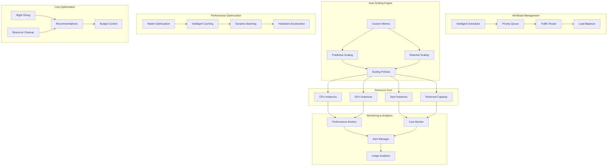

# Technical Architecture: AI Performance Optimization & Auto-Scaling

## Architecture Overview

The AI Performance Optimization & Auto-Scaling solution provides intelligent resource management, automated scaling, and comprehensive performance optimization for AI workloads. This architecture ensures optimal cost-performance balance while maintaining high availability and responsiveness.



## Core Architecture Components

### 1. Intelligent Workload Management

#### Traffic Routing and Load Balancing
```yaml
# Intelligent Traffic Routing Configuration
traffic_management:
  routing_strategy:
    algorithm: "weighted_least_connections"
    health_check:
      interval: "10s"
      timeout: "5s"
      healthy_threshold: 2
      unhealthy_threshold: 3
    
    load_balancing:
      session_affinity: "none"
      connection_draining: "30s"
      cross_zone_balancing: true
    
    traffic_splitting:
      - endpoint: "production_cluster"
        weight: 90
        conditions:
          - "normal_traffic"
      
      - endpoint: "canary_cluster"
        weight: 10
        conditions:
          - "canary_deployment"
    
    failover:
      primary_region: "us-ashburn-1"
      backup_regions: ["us-phoenix-1", "ca-toronto-1"]
      failover_criteria:
        - "endpoint_health < 50%"
        - "response_time > 2000ms"
  
  request_classification:
    priority_levels:
      - name: "critical"
        sla_target: "100ms"
        cpu_weight: 1.0
        gpu_weight: 1.0
        queue_timeout: "500ms"
      
      - name: "high"
        sla_target: "500ms"
        cpu_weight: 0.8
        gpu_weight: 0.8
        queue_timeout: "2s"
      
      - name: "normal"
        sla_target: "1000ms"
        cpu_weight: 0.6
        gpu_weight: 0.6
        queue_timeout: "5s"
      
      - name: "batch"
        sla_target: "10s"
        cpu_weight: 0.3
        gpu_weight: 0.3
        queue_timeout: "30s"
    
    classification_rules:
      - condition: "api_key IN premium_users"
        priority: "critical"
      
      - condition: "endpoint CONTAINS '/real-time/'"
        priority: "high"
      
      - condition: "batch_size > 100"
        priority: "batch"
      
      - condition: "default"
        priority: "normal"
```

#### Intelligent Scheduling
```yaml
# Advanced Scheduling Configuration
scheduling:
  algorithms:
    primary: "bin_packing_first_fit_decreasing"
    fallback: "round_robin"
    
  resource_constraints:
    cpu:
      min_allocation: "100m"
      max_allocation: "32000m"
      overcommit_ratio: 1.2
    
    memory:
      min_allocation: "128Mi"
      max_allocation: "256Gi"
      overcommit_ratio: 1.1
    
    gpu:
      min_allocation: "0.1"
      max_allocation: "8.0"
      overcommit_ratio: 1.0
      
    storage:
      min_allocation: "1Gi"
      max_allocation: "1Ti"
      performance_tier: "balanced"
  
  scheduling_policies:
    affinity_rules:
      - type: "model_affinity"
        rule: "prefer_same_node"
        weight: 100
      
      - type: "data_locality"
        rule: "prefer_zone_with_data"
        weight: 80
      
      - type: "cost_optimization"
        rule: "prefer_spot_instances"
        weight: 60
    
    anti_affinity_rules:
      - type: "availability"
        rule: "spread_across_zones"
        weight: 90
      
      - type: "performance"
        rule: "avoid_noisy_neighbors"
        weight: 70
  
  preemption_policy:
    enabled: true
    criteria:
      - "priority_difference >= 2"
      - "resource_pressure > 80%"
    
    grace_period: "30s"
    checkpoint_enabled: true
```

### 2. Auto-Scaling Framework

#### Predictive Scaling Engine
```yaml
# Predictive Scaling Configuration
predictive_scaling:
  forecasting_models:
    - name: "arima_model"
      type: "time_series"
      features: ["historical_load", "time_of_day", "day_of_week"]
      horizon: "2h"
      confidence_interval: 0.95
      
    - name: "lstm_model"
      type: "neural_network"
      features: ["load_history", "external_events", "business_metrics"]
      horizon: "4h"
      update_frequency: "daily"
    
    - name: "ensemble_model"
      type: "ensemble"
      models: ["arima_model", "lstm_model"]
      weights: [0.4, 0.6]
      fallback: "linear_regression"
  
  scaling_decisions:
    forecast_accuracy_threshold: 0.8
    confidence_threshold: 0.7
    lead_time:
      scale_up: "10m"
      scale_down: "20m"
    
    buffer_policies:
      - metric: "cpu_utilization"
        target: 70
        buffer: 20
      
      - metric: "memory_utilization"
        target: 75
        buffer: 15
      
      - metric: "gpu_utilization"
        target: 80
        buffer: 10
  
  external_signals:
    business_events:
      - name: "product_launch"
        impact_multiplier: 2.5
        duration: "7d"
      
      - name: "marketing_campaign"
        impact_multiplier: 1.8
        duration: "3d"
    
    calendar_events:
      - name: "black_friday"
        impact_multiplier: 5.0
        duration: "1d"
      
      - name: "holiday_season"
        impact_multiplier: 2.0
        duration: "30d"
```

#### Reactive Scaling Policies
```yaml
# Reactive Scaling Configuration
reactive_scaling:
  scaling_policies:
    - name: "cpu_scale_up"
      metric: "cpu_utilization"
      threshold: 75
      direction: "up"
      cooldown: "5m"
      step_size: "25%"
      max_instances: 100
      
    - name: "cpu_scale_down"
      metric: "cpu_utilization"
      threshold: 30
      direction: "down"
      cooldown: "10m"
      step_size: "10%"
      min_instances: 2
    
    - name: "memory_scale_up"
      metric: "memory_utilization"
      threshold: 80
      direction: "up"
      cooldown: "3m"
      step_size: "50%"
      max_instances: 100
    
    - name: "gpu_scale_up"
      metric: "gpu_utilization"
      threshold: 85
      direction: "up"
      cooldown: "2m"
      step_size: "100%"
      max_instances: 50
    
    - name: "request_rate_scale_up"
      metric: "requests_per_second"
      threshold: 1000
      direction: "up"
      cooldown: "2m"
      step_size: "30%"
      max_instances: 200
    
    - name: "queue_depth_scale_up"
      metric: "queue_depth"
      threshold: 50
      direction: "up"
      cooldown: "1m"
      step_size: "50%"
      max_instances: 150
  
  custom_metrics:
    - name: "inference_latency_p95"
      query: "quantile(0.95, inference_duration_seconds)"
      threshold: 2.0
      scaling_factor: 1.5
    
    - name: "model_accuracy"
      query: "model_accuracy_score"
      threshold: 0.9
      action: "alert_only"
    
    - name: "cost_per_inference"
      query: "total_cost / total_inferences"
      threshold: 0.01
      action: "optimize_resources"
  
  scaling_constraints:
    global_limits:
      max_total_instances: 500
      max_cost_per_hour: 1000
      min_availability_zones: 2
    
    resource_quotas:
      cpu_cores: 2000
      memory_gb: 8000
      gpu_count: 100
      storage_tb: 50
```

### 3. Performance Optimization Layer

#### Model Optimization Pipeline
```yaml
# Model Optimization Configuration
model_optimization:
  optimization_techniques:
    quantization:
      enabled: true
      precision: ["int8", "fp16"]
      calibration_dataset_size: 1000
      accuracy_threshold: 0.02
      
    pruning:
      enabled: true
      sparsity_targets: [0.5, 0.7, 0.9]
      structured_pruning: true
      fine_tuning_epochs: 10
    
    distillation:
      enabled: true
      teacher_model_path: "/models/teacher"
      temperature: 4.0
      alpha: 0.7
      student_architecture: "efficient_net_b0"
    
    compilation:
      frameworks: ["tensorrt", "onnx_runtime", "tvm"]
      optimization_level: "aggressive"
      target_hardware: ["gpu", "cpu"]
      batch_sizes: [1, 8, 16, 32]
  
  hardware_acceleration:
    gpu_optimization:
      mixed_precision: true
      tensor_cores: true
      memory_optimization: "swap_attention"
      max_batch_size: 64
    
    cpu_optimization:
      vectorization: "avx512"
      threading: "openmp"
      numa_awareness: true
      prefetching: "aggressive"
    
    memory_optimization:
      gradient_checkpointing: true
      activation_checkpointing: true
      offloading: "cpu"
      compression: "lz4"
  
  performance_testing:
    benchmarking:
      warmup_iterations: 100
      measurement_iterations: 1000
      input_sizes: ["small", "medium", "large"]
      concurrency_levels: [1, 4, 16, 64]
    
    validation:
      accuracy_tests: true
      latency_tests: true
      throughput_tests: true
      memory_tests: true
      
    acceptance_criteria:
      max_latency_increase: "10%"
      min_throughput_improvement: "20%"
      max_accuracy_loss: "1%"
      max_memory_increase: "15%"
```

#### Intelligent Caching System
```yaml
# Caching Configuration
caching:
  cache_levels:
    l1_cache:
      type: "in_memory"
      size: "1GB"
      eviction_policy: "lru"
      ttl: "1h"
      location: "inference_service"
      
    l2_cache:
      type: "redis_cluster"
      size: "10GB"
      eviction_policy: "allkeys-lru"
      ttl: "24h"
      replication: 3
      
    l3_cache:
      type: "object_storage"
      size: "1TB"
      storage_class: "standard"
      ttl: "7d"
      compression: "gzip"
  
  caching_strategies:
    input_hashing:
      algorithm: "sha256"
      feature_selection: "all"
      similarity_threshold: 0.95
      approximate_matching: true
      
    result_caching:
      cache_hits_threshold: 5
      confidence_threshold: 0.9
      versioning: "semantic"
      invalidation_triggers:
        - "model_update"
        - "data_drift_detected"
    
    predictive_caching:
      enabled: true
      prediction_horizon: "1h"
      cache_warming: "background"
      popularity_scoring: "weighted_frequency"
  
  cache_optimization:
    partitioning:
      strategy: "consistent_hashing"
      partition_count: 32
      rebalancing: "automatic"
      
    compression:
      algorithms: ["lz4", "zstd", "gzip"]
      compression_threshold: "1KB"
      adaptive_compression: true
      
    monitoring:
      metrics: ["hit_rate", "miss_rate", "latency", "size"]
      alerting_thresholds:
        hit_rate: 0.8
        latency_p99: "10ms"
        memory_usage: 0.9
```

### 4. Cost Optimization Engine

#### Resource Right-Sizing
```yaml
# Resource Right-Sizing Configuration
right_sizing:
  analysis_period: "7d"
  recommendation_frequency: "daily"
  implementation_mode: "automated_with_approval"
  
  sizing_algorithms:
    cpu_sizing:
      target_utilization: 70
      percentile: 95
      minimum_size: "100m"
      growth_buffer: 20
      
    memory_sizing:
      target_utilization: 75
      percentile: 95
      minimum_size: "128Mi"
      growth_buffer: 15
      
    gpu_sizing:
      target_utilization: 80
      percentile: 90
      fractional_gpus: true
      sharing_enabled: true
  
  cost_optimization:
    instance_families:
      - family: "standard"
        cpu_cost_per_hour: 0.05
        memory_cost_per_gb_hour: 0.01
        use_cases: ["general_inference"]
        
      - family: "gpu_optimized"
        gpu_cost_per_hour: 2.50
        cpu_cost_per_hour: 0.10
        use_cases: ["deep_learning", "computer_vision"]
        
      - family: "memory_optimized"
        memory_cost_per_gb_hour: 0.008
        cpu_cost_per_hour: 0.08
        use_cases: ["large_models", "feature_stores"]
    
    spot_instance_optimization:
      max_spot_percentage: 70
      diversification_strategy: "across_families"
      interruption_handling: "graceful_drain"
      savings_target: 60
  
  automation_rules:
    auto_apply_conditions:
      - "cost_savings > 15%"
      - "performance_impact < 5%"
      - "confidence_score > 0.8"
      
    approval_required_conditions:
      - "cost_savings > 50%"
      - "instance_family_change"
      - "production_workload"
```

#### Budget Management and Alerts
```yaml
# Budget and Cost Control Configuration
budget_management:
  budget_policies:
    - name: "monthly_ai_budget"
      limit: 50000
      period: "monthly"
      currency: "USD"
      scope: "ai_workloads"
      
      thresholds:
        - percentage: 50
          action: "notify"
          recipients: ["finance_team", "engineering_leads"]
          
        - percentage: 80
          action: "approval_required"
          approvers: ["cfo", "cto"]
          
        - percentage: 95
          action: "scale_down_non_critical"
          affected_workloads: ["development", "testing"]
          
        - percentage: 100
          action: "emergency_stop"
          exceptions: ["production_critical"]
    
    - name: "project_budget"
      limit: 5000
      period: "monthly"
      scope: "per_project"
      enforcement: "hard_limit"
  
  cost_allocation:
    tagging_strategy:
      required_tags:
        - "project"
        - "environment"
        - "team"
        - "cost_center"
        
      auto_tagging_rules:
        - condition: "namespace CONTAINS 'prod'"
          tags: {"environment": "production"}
          
        - condition: "service_account CONTAINS 'ml-team'"
          tags: {"team": "machine_learning"}
    
    chargeback_model:
      allocation_method: "usage_based"
      billing_frequency: "monthly"
      cost_categories:
        - "compute_costs"
        - "storage_costs"
        - "network_costs"
        - "managed_service_costs"
  
  cost_optimization_automation:
    scheduled_actions:
      - schedule: "0 18 * * 1-5"  # 6 PM weekdays
        action: "scale_down_dev_environments"
        savings_percentage: 80
        
      - schedule: "0 8 * * 1-5"   # 8 AM weekdays
        action: "scale_up_dev_environments"
        restore_previous_state: true
        
      - schedule: "0 0 * * 0"     # Sunday midnight
        action: "cleanup_unused_resources"
        age_threshold: "7d"
        
    dynamic_pricing:
      spot_instance_bidding:
        max_bid_percentage: 40
        bid_strategy: "diversified"
        interruption_tolerance: "high"
        
      reserved_instance_recommendations:
        commitment_period: ["1year", "3year"]
        payment_option: "partial_upfront"
        utilization_threshold: 80
```

### 5. Monitoring and Observability

#### Performance Monitoring Dashboard
```yaml
# Monitoring Configuration
monitoring:
  metrics_collection:
    system_metrics:
      - "cpu_utilization"
      - "memory_utilization"
      - "gpu_utilization"
      - "disk_io"
      - "network_io"
      collection_interval: "10s"
      retention_period: "30d"
      
    application_metrics:
      - "inference_latency"
      - "throughput"
      - "queue_depth"
      - "error_rate"
      - "cache_hit_rate"
      collection_interval: "5s"
      retention_period: "90d"
      
    business_metrics:
      - "cost_per_inference"
      - "revenue_per_prediction"
      - "customer_satisfaction_score"
      - "model_accuracy"
      collection_interval: "1m"
      retention_period: "1y"
  
  alerting_rules:
    performance_alerts:
      - name: "high_latency"
        condition: "inference_latency_p95 > 2000ms"
        severity: "warning"
        duration: "5m"
        
      - name: "low_throughput"
        condition: "requests_per_second < 100"
        severity: "critical"
        duration: "2m"
        
      - name: "resource_exhaustion"
        condition: "cpu_utilization > 90%"
        severity: "critical"
        duration: "1m"
    
    cost_alerts:
      - name: "budget_exceeded"
        condition: "daily_cost > budget_limit * 1.2"
        severity: "critical"
        notification_channels: ["slack", "email", "pagerduty"]
        
      - name: "cost_anomaly"
        condition: "hourly_cost > moving_average_7d * 2"
        severity: "warning"
        auto_investigation: true
  
  dashboards:
    executive_dashboard:
      metrics:
        - "total_cost_trend"
        - "performance_sla_compliance"
        - "capacity_utilization"
        - "optimization_savings"
      refresh_interval: "5m"
      
    operational_dashboard:
      metrics:
        - "real_time_performance"
        - "resource_utilization"
        - "scaling_events"
        - "error_rates"
      refresh_interval: "30s"
      
    cost_dashboard:
      metrics:
        - "cost_breakdown"
        - "optimization_opportunities"
        - "budget_tracking"
        - "trending_analysis"
      refresh_interval: "1h"
```

## Integration Architecture

### Oracle Cloud Infrastructure Integration
```yaml
# OCI Service Integration
oci_integration:
  compute_services:
    vm_instances:
      shapes: ["VM.Standard3.Flex", "VM.Optimized3.Flex"]
      auto_scaling: "enabled"
      placement_groups: "spread"
      
    gpu_instances:
      shapes: ["VM.GPU3.1", "VM.GPU3.2", "VM.GPU3.4"]
      gpu_sharing: "enabled"
      memory_optimization: "enabled"
      
    bare_metal:
      shapes: ["BM.GPU4.8", "BM.HPC2.36"]
      use_cases: ["large_models", "high_performance"]
      
    functions:
      memory_configs: [128, 256, 512, 1024, 2048, 3008]
      timeout: "300s"
      concurrency: 100
  
  container_services:
    oke_configuration:
      kubernetes_version: "1.28"
      node_pools:
        - name: "cpu_pool"
          min_nodes: 2
          max_nodes: 100
          instance_shape: "VM.Standard3.Flex"
          
        - name: "gpu_pool"
          min_nodes: 0
          max_nodes: 50
          instance_shape: "VM.GPU3.1"
          
      cluster_autoscaler:
        enabled: true
        scale_down_delay: "10m"
        scale_down_unneeded: "5m"
  
  storage_optimization:
    block_storage:
      performance_tiers: ["basic", "balanced", "higher_performance"]
      auto_tuning: "enabled"
      
    object_storage:
      storage_tiers: ["standard", "infrequent_access", "archive"]
      lifecycle_policies: "automated"
      
    file_storage:
      performance_mode: "general_purpose"
      throughput_mode: "provisioned"
```

### Multi-Cloud Integration
```yaml
# Multi-Cloud Resource Management
multi_cloud:
  cloud_providers:
    - name: "oci"
      primary: true
      cost_weight: 1.0
      performance_weight: 1.0
      
    - name: "aws"
      primary: false
      cost_weight: 1.2
      performance_weight: 0.9
      
    - name: "azure"
      primary: false
      cost_weight: 1.1
      performance_weight: 0.95
  
  workload_placement:
    placement_strategy: "cost_optimized"
    constraints:
      - "data_gravity"
      - "compliance_requirements"
      - "latency_requirements"
      
    migration_policies:
      - condition: "cost_savings > 20%"
        action: "migrate_batch_workloads"
        
      - condition: "performance_improvement > 30%"
        action: "migrate_inference_workloads"
```

This technical architecture provides a comprehensive foundation for implementing enterprise-scale AI performance optimization and auto-scaling capabilities. The modular design enables incremental adoption while ensuring optimal cost-performance balance across diverse AI workloads.