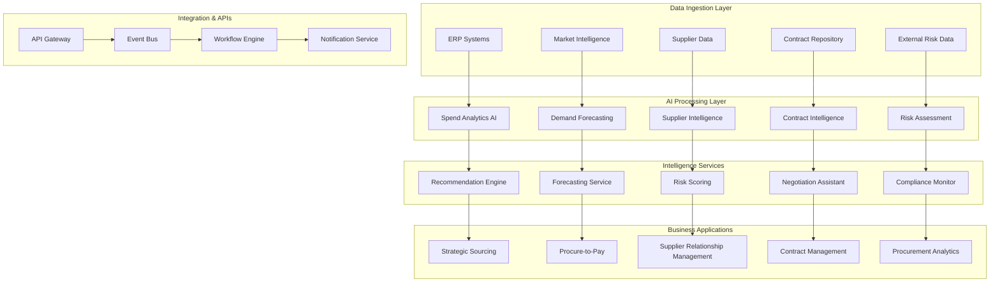

# Technical Architecture: Intelligent Procurement & Supply Chain Optimization

## Architecture Overview

The Intelligent Procurement & Supply Chain Optimization solution provides comprehensive AI-driven capabilities for procurement transformation, supplier intelligence, demand forecasting, and contract management. This architecture enables data-driven procurement decisions while optimizing costs and managing risks.



## Core Architecture Components

### 1. Data Integration and Management Layer

#### Data Sources Integration
```yaml
# Data Integration Configuration
data_sources:
  internal_systems:
    erp_integration:
      - system: "Oracle Fusion ERP"
        modules: ["Procurement", "Financials", "Supply Chain"]
        sync_frequency: "real_time"
        data_types: ["transactions", "master_data", "approvals"]
        
      - system: "SAP ERP"
        modules: ["MM", "FI", "SD"]
        sync_frequency: "hourly"
        data_types: ["purchase_orders", "invoices", "receipts"]
    
    procurement_platforms:
      - platform: "Ariba"
        data_types: ["sourcing_events", "contracts", "supplier_data"]
        sync_frequency: "daily"
        
      - platform: "Coupa"
        data_types: ["spend_data", "supplier_performance", "catalogs"]
        sync_frequency: "real_time"
  
  external_sources:
    supplier_risk_data:
      - provider: "Dun_Bradstreet"
        data_types: ["financial_health", "credit_scores", "business_insights"]
        refresh_frequency: "weekly"
        
      - provider: "Moodys_Analytics"
        data_types: ["risk_assessments", "industry_analysis", "economic_indicators"]
        refresh_frequency: "daily"
    
    market_intelligence:
      - provider: "Bloomberg"
        data_types: ["commodity_prices", "market_trends", "economic_data"]
        refresh_frequency: "real_time"
        
      - provider: "S&P_Global"
        data_types: ["industry_benchmarks", "supplier_intelligence", "market_analysis"]
        refresh_frequency: "daily"
  
  document_sources:
    contract_repositories:
      - location: "SharePoint"
        document_types: ["contracts", "amendments", "sows"]
        processing: "automated_extraction"
        
      - location: "Document_Management_System"
        document_types: ["rfps", "proposals", "terms_conditions"]
        processing: "ai_enhanced_review"

data_processing:
  data_quality:
    validation_rules:
      - field: "supplier_id"
        rule: "unique_and_not_null"
        action: "reject_duplicate"
        
      - field: "spend_amount"
        rule: "positive_numeric"
        action: "flag_for_review"
        
      - field: "contract_end_date"
        rule: "future_date"
        action: "alert_stakeholder"
    
    cleansing_procedures:
      - procedure: "supplier_name_standardization"
        frequency: "daily"
        rules: ["remove_duplicates", "normalize_naming", "merge_entities"]
        
      - procedure: "spend_classification"
        frequency: "real_time"
        rules: ["auto_categorize", "validate_gl_codes", "detect_anomalies"]
  
  data_enrichment:
    supplier_enrichment:
      - source: "external_risk_data"
        fields: ["financial_score", "risk_rating", "industry_classification"]
        
      - source: "market_intelligence"
        fields: ["market_position", "competitive_landscape", "innovation_score"]
    
    spend_enrichment:
      - source: "category_taxonomy"
        fields: ["spend_category", "subcategory", "commodity_code"]
        
      - source: "benchmark_data"
        fields: ["market_price", "best_practice", "savings_opportunity"]
```

### 2. AI and Analytics Engine

#### Supplier Intelligence Platform
```yaml
# Supplier Intelligence Configuration
supplier_intelligence:
  risk_assessment:
    risk_factors:
      financial_health:
        weight: 0.3
        metrics: ["credit_score", "debt_ratio", "cash_flow", "profitability"]
        data_sources: ["dun_bradstreet", "financial_statements", "payment_history"]
        
      operational_performance:
        weight: 0.25
        metrics: ["on_time_delivery", "quality_score", "capacity_utilization"]
        data_sources: ["delivery_data", "quality_reports", "capacity_assessments"]
        
      compliance_status:
        weight: 0.2
        metrics: ["certifications", "audit_results", "regulatory_compliance"]
        data_sources: ["compliance_database", "audit_reports", "certification_records"]
        
      geographic_risk:
        weight: 0.15
        metrics: ["political_stability", "economic_conditions", "natural_disaster_risk"]
        data_sources: ["risk_intelligence", "geographic_data", "news_sentiment"]
        
      cyber_security:
        weight: 0.1
        metrics: ["security_certifications", "breach_history", "security_practices"]
        data_sources: ["security_assessments", "breach_databases", "certification_records"]
    
    scoring_algorithm:
      model_type: "ensemble"
      algorithms: ["random_forest", "gradient_boosting", "neural_network"]
      weights: [0.4, 0.4, 0.2]
      update_frequency: "weekly"
      
    risk_thresholds:
      low_risk: "score >= 80"
      medium_risk: "score >= 60 AND score < 80"
      high_risk: "score >= 40 AND score < 60"
      critical_risk: "score < 40"
  
  performance_analytics:
    kpi_tracking:
      delivery_performance:
        metrics: ["on_time_delivery_rate", "delivery_accuracy", "lead_time_variance"]
        calculation_period: "rolling_12_months"
        benchmark_comparison: "category_peers"
        
      quality_performance:
        metrics: ["defect_rate", "return_rate", "quality_audit_score"]
        calculation_period: "rolling_6_months"
        improvement_tracking: "trend_analysis"
        
      cost_performance:
        metrics: ["price_competitiveness", "total_cost_ownership", "savings_delivered"]
        calculation_period: "annual"
        market_comparison: "enabled"
    
    predictive_analytics:
      performance_prediction:
        model: "time_series_forecasting"
        features: ["historical_performance", "market_conditions", "supplier_capacity"]
        prediction_horizon: "6_months"
        
      risk_prediction:
        model: "classification"
        features: ["financial_trends", "market_volatility", "operational_indicators"]
        prediction_confidence: "confidence_intervals"
```

#### Demand Forecasting and Planning
```yaml
# Demand Forecasting Configuration
demand_forecasting:
  forecasting_models:
    time_series_models:
      - model: "arima"
        use_cases: ["stable_demand_patterns"]
        parameters:
          seasonality: "auto_detect"
          trend: "auto_detect"
          confidence_interval: 0.95
          
      - model: "prophet"
        use_cases: ["seasonal_demand", "holiday_effects"]
        parameters:
          seasonality_mode: "multiplicative"
          holiday_effects: "country_specific"
          growth: "linear"
          
      - model: "lstm"
        use_cases: ["complex_patterns", "external_factors"]
        parameters:
          sequence_length: 12
          hidden_layers: [128, 64, 32]
          dropout_rate: 0.2
    
    ensemble_forecasting:
      combination_method: "weighted_average"
      model_weights:
        arima: 0.3
        prophet: 0.4
        lstm: 0.3
      performance_tracking: "mape_scoring"
      model_selection: "dynamic_weighting"
  
  external_factors:
    economic_indicators:
      - indicator: "gdp_growth"
        correlation_analysis: "quarterly"
        lag_periods: [1, 2, 3, 4]
        
      - indicator: "inflation_rate"
        correlation_analysis: "monthly"
        impact_assessment: "category_specific"
    
    market_events:
      - event_type: "product_launches"
        impact_multiplier: "1.2_to_2.5"
        duration: "3_to_6_months"
        
      - event_type: "competitor_actions"
        impact_assessment: "market_share_analysis"
        response_planning: "scenario_based"
    
    seasonal_patterns:
      - pattern: "holiday_seasonality"
        categories: ["consumer_goods", "retail_services"]
        adjustment_factors: "historical_analysis"
        
      - pattern: "business_cycles"
        categories: ["industrial_supplies", "capital_equipment"]
        cycle_identification: "trend_analysis"
  
  inventory_optimization:
    safety_stock_calculation:
      method: "service_level_approach"
      target_service_level: 0.95
      lead_time_variability: "statistical_analysis"
      demand_variability: "forecast_accuracy"
      
    reorder_point_optimization:
      calculation: "demand_during_lead_time + safety_stock"
      dynamic_adjustment: "demand_pattern_changes"
      supplier_performance_factor: "delivery_reliability"
      
    economic_order_quantity:
      optimization_objective: "total_cost_minimization"
      cost_factors: ["ordering_cost", "holding_cost", "stockout_cost"]
      constraint_handling: "storage_capacity", "cash_flow"
```

#### Contract Intelligence Engine
```yaml
# Contract Intelligence Configuration
contract_intelligence:
  document_processing:
    extraction_capabilities:
      key_terms:
        - "contract_value"
        - "payment_terms"
        - "delivery_terms"
        - "penalty_clauses"
        - "termination_conditions"
        - "renewal_options"
        
      legal_clauses:
        - "liability_limitations"
        - "indemnification"
        - "intellectual_property"
        - "force_majeure"
        - "governing_law"
        
      commercial_terms:
        - "pricing_mechanisms"
        - "volume_commitments"
        - "service_level_agreements"
        - "performance_metrics"
        - "incentive_structures"
    
    natural_language_processing:
      entity_recognition:
        models: ["named_entity_recognition", "custom_legal_entities"]
        accuracy_threshold: 0.9
        confidence_scoring: "enabled"
        
      clause_classification:
        taxonomy: "legal_taxonomy"
        classification_confidence: 0.85
        manual_review_threshold: 0.7
        
      risk_identification:
        risk_categories: ["financial", "operational", "legal", "compliance"]
        risk_scoring: "severity_and_likelihood"
        escalation_rules: "risk_threshold_based"
  
  contract_analysis:
    compliance_monitoring:
      regulatory_requirements:
        - regulation: "gdpr"
          clauses: ["data_protection", "privacy_rights", "data_retention"]
          compliance_check: "automated"
          
        - regulation: "sox"
          clauses: ["financial_controls", "audit_rights", "reporting_requirements"]
          compliance_check: "quarterly_review"
      
      internal_policies:
        - policy: "procurement_policy"
          requirements: ["approval_limits", "competitive_bidding", "supplier_qualification"]
          validation: "workflow_integration"
          
        - policy: "risk_management"
          requirements: ["insurance_coverage", "liability_limits", "performance_bonds"]
          validation: "automated_checking"
    
    negotiation_support:
      clause_recommendations:
        data_source: "historical_negotiations"
        success_metrics: ["cost_savings", "risk_mitigation", "cycle_time"]
        personalization: "category_and_supplier_specific"
        
      benchmarking:
        comparison_basis: ["industry_standards", "peer_contracts", "market_terms"]
        metrics: ["pricing", "terms", "conditions"]
        update_frequency: "quarterly"
        
      alternative_suggestions:
        generation_method: "ai_powered_alternatives"
        optimization_criteria: ["cost", "risk", "flexibility"]
        legal_review: "automated_flagging"
```

### 3. Business Application Layer

#### Strategic Sourcing Platform
```yaml
# Strategic Sourcing Configuration
strategic_sourcing:
  sourcing_events:
    event_types:
      rfp_management:
        workflow_automation:
          - "requirement_gathering"
          - "supplier_identification"
          - "proposal_evaluation"
          - "negotiation_support"
          - "award_recommendation"
        
        ai_assistance:
          - "requirement_optimization"
          - "supplier_shortlisting"
          - "proposal_analysis"
          - "risk_assessment"
        
      reverse_auctions:
        optimization_algorithms:
          - "dynamic_pricing"
          - "multi_attribute_scoring"
          - "supplier_behavior_analysis"
          - "market_efficiency_monitoring"
        
        automation_features:
          - "bid_validation"
          - "rank_updating"
          - "extension_management"
          - "award_processing"
    
    supplier_discovery:
      discovery_sources:
        - "internal_database"
        - "supplier_networks"
        - "market_intelligence"
        - "ai_recommendations"
      
      qualification_criteria:
        financial_stability:
          requirements: ["credit_rating", "financial_statements", "insurance"]
          scoring_weight: 0.3
          
        technical_capability:
          requirements: ["certifications", "references", "case_studies"]
          scoring_weight: 0.25
          
        operational_capacity:
          requirements: ["facility_assessment", "capacity_analysis", "quality_systems"]
          scoring_weight: 0.25
          
        compliance_status:
          requirements: ["regulatory_compliance", "audit_results", "certifications"]
          scoring_weight: 0.2
  
  award_optimization:
    multi_criteria_decision:
      criteria_weighting:
        cost: 0.4
        quality: 0.2
        delivery: 0.15
        risk: 0.15
        innovation: 0.1
      
      optimization_algorithms:
        - "pareto_optimization"
        - "analytical_hierarchy_process"
        - "fuzzy_logic_evaluation"
        - "monte_carlo_simulation"
    
    scenario_analysis:
      scenarios:
        - "single_source_award"
        - "multi_source_split"
        - "backup_supplier_strategy"
        - "regional_allocation"
      
      evaluation_metrics:
        - "total_cost_impact"
        - "risk_mitigation"
        - "supplier_development"
        - "innovation_potential"
```

#### Supplier Relationship Management
```yaml
# SRM Configuration
supplier_relationship_management:
  performance_management:
    scorecard_framework:
      performance_categories:
        quality:
          weight: 0.3
          metrics: ["defect_rate", "first_pass_yield", "customer_complaints"]
          measurement_frequency: "monthly"
          
        delivery:
          weight: 0.25
          metrics: ["on_time_delivery", "complete_delivery", "lead_time_performance"]
          measurement_frequency: "weekly"
          
        cost:
          weight: 0.2
          metrics: ["price_competitiveness", "cost_reduction", "total_cost_ownership"]
          measurement_frequency: "quarterly"
          
        service:
          weight: 0.15
          metrics: ["responsiveness", "problem_resolution", "communication_quality"]
          measurement_frequency: "monthly"
          
        innovation:
          weight: 0.1
          metrics: ["innovation_proposals", "implementation_success", "value_creation"]
          measurement_frequency: "quarterly"
    
    improvement_programs:
      supplier_development:
        program_types:
          - "capability_building"
          - "process_improvement"
          - "technology_adoption"
          - "sustainability_enhancement"
        
        success_metrics:
          - "performance_improvement"
          - "cost_reduction"
          - "quality_enhancement"
          - "delivery_reliability"
      
      collaboration_initiatives:
        - initiative: "joint_innovation"
          objectives: ["product_development", "process_optimization", "market_expansion"]
          measurement: ["innovation_pipeline", "time_to_market", "revenue_impact"]
          
        - initiative: "sustainability_partnership"
          objectives: ["carbon_reduction", "waste_minimization", "circular_economy"]
          measurement: ["environmental_impact", "sustainability_score", "compliance_rating"]
  
  risk_monitoring:
    continuous_monitoring:
      monitoring_frequency: "real_time"
      risk_indicators:
        - "financial_health_changes"
        - "operational_disruptions"
        - "compliance_violations"
        - "market_position_changes"
      
      alert_system:
        severity_levels: ["low", "medium", "high", "critical"]
        escalation_matrix:
          low: "category_manager"
          medium: "procurement_director"
          high: "cpo_and_business_stakeholders"
          critical: "executive_team_and_crisis_management"
    
    mitigation_strategies:
      risk_response_plans:
        - risk_type: "supplier_bankruptcy"
          response: ["alternative_sourcing", "inventory_buildup", "contract_transfer"]
          timeline: "immediate_to_30_days"
          
        - risk_type: "quality_issues"
          response: ["quality_audit", "corrective_action_plan", "secondary_sourcing"]
          timeline: "7_to_14_days"
          
        - risk_type: "delivery_disruption"
          response: ["expedited_shipping", "alternative_suppliers", "production_adjustment"]
          timeline: "immediate_to_7_days"
```

### 4. Analytics and Reporting

#### Procurement Analytics Dashboard
```yaml
# Analytics Configuration
procurement_analytics:
  spend_analytics:
    spend_visibility:
      dimensions:
        - "category"
        - "supplier"
        - "business_unit"
        - "geography"
        - "time_period"
        - "cost_center"
      
      metrics:
        - "total_spend"
        - "spend_under_management"
        - "contract_vs_maverick_spend"
        - "supplier_concentration"
        - "category_distribution"
        - "spend_growth_trends"
      
      analysis_types:
        - "spend_cube_analysis"
        - "pareto_analysis"
        - "trend_analysis"
        - "variance_analysis"
        - "benchmark_comparison"
    
    savings_tracking:
      savings_categories:
        - "price_reduction"
        - "demand_management"
        - "specification_optimization"
        - "process_improvement"
        - "supplier_consolidation"
      
      calculation_methods:
        baseline_establishment: "previous_period_price"
        savings_validation: "actual_vs_baseline"
        attribution_logic: "sourcing_event_linkage"
        
      reporting_frequency: "monthly"
      stakeholder_distribution: "automated_dashboards"
  
  performance_dashboards:
    executive_dashboard:
      refresh_frequency: "daily"
      key_metrics:
        - "total_procurement_spend"
        - "cost_savings_achieved"
        - "supplier_performance_index"
        - "contract_compliance_rate"
        - "risk_exposure_level"
      
      visualization_types:
        - "executive_summary_cards"
        - "trend_charts"
        - "geographic_heat_maps"
        - "performance_scorecards"
    
    operational_dashboard:
      refresh_frequency: "real_time"
      key_metrics:
        - "purchase_order_status"
        - "supplier_delivery_performance"
        - "invoice_processing_time"
        - "approval_cycle_time"
        - "quality_incident_tracking"
      
      alert_integration:
        - "threshold_breaches"
        - "exception_handling"
        - "escalation_notifications"
        - "trend_deviations"
  
  predictive_analytics:
    demand_forecasting:
      forecasting_models:
        - "seasonal_decomposition"
        - "regression_analysis"
        - "machine_learning_models"
        - "ensemble_methods"
      
      forecast_accuracy:
        measurement: "mean_absolute_percentage_error"
        target_accuracy: "85%"
        improvement_tracking: "continuous_monitoring"
    
    price_forecasting:
      commodity_price_prediction:
        data_sources: ["market_data", "economic_indicators", "supply_demand_analysis"]
        prediction_horizon: "12_months"
        confidence_intervals: "statistical_confidence_bands"
      
      supplier_price_modeling:
        factors: ["raw_material_costs", "labor_costs", "overhead_allocation", "margin_analysis"]
        model_types: ["cost_plus_modeling", "market_based_pricing", "value_based_pricing"]
```

## Integration Architecture

### Oracle Cloud Integration
```yaml
# Oracle Integration Configuration
oracle_integration:
  fusion_applications:
    procurement_cloud:
      integration_points:
        - "supplier_master_data"
        - "purchase_requisitions"
        - "purchase_orders"
        - "receipt_transactions"
        - "invoice_processing"
      
      data_synchronization:
        frequency: "real_time"
        conflict_resolution: "source_system_priority"
        error_handling: "retry_and_escalate"
    
    supply_chain_management:
      integration_scope:
        - "demand_planning"
        - "inventory_management"
        - "supplier_collaboration"
        - "order_management"
      
      collaboration_features:
        - "supplier_portal_integration"
        - "demand_signal_sharing"
        - "capacity_planning_collaboration"
        - "performance_data_exchange"
  
  oci_services:
    generative_ai:
      use_cases:
        - "contract_analysis_and_summarization"
        - "supplier_communication_assistance"
        - "negotiation_strategy_recommendations"
        - "risk_assessment_explanations"
      
      model_configuration:
        base_model: "oracle_proprietary_llm"
        fine_tuning: "procurement_domain_specific"
        safety_measures: "content_filtering_and_bias_detection"
    
    document_understanding:
      document_types:
        - "contracts_and_agreements"
        - "supplier_certifications"
        - "rfp_responses"
        - "invoices_and_receipts"
      
      extraction_accuracy:
        target_accuracy: "95%"
        human_review_threshold: "90%"
        continuous_learning: "feedback_integration"
    
    data_science_platform:
      model_deployment:
        - "demand_forecasting_models"
        - "supplier_risk_scoring"
        - "price_optimization_algorithms"
        - "spend_classification_models"
      
      mlops_integration:
        model_versioning: "automated"
        performance_monitoring: "continuous"
        model_retraining: "scheduled_and_triggered"
```

### External System Integration
```yaml
# External Integration Configuration
external_integrations:
  erp_systems:
    sap_integration:
      connection_type: "api_and_idoc"
      modules: ["mm", "fi", "sd"]
      data_flow: "bidirectional"
      
    other_erp_systems:
      - system: "microsoft_dynamics"
        connection: "rest_api"
        authentication: "oauth2"
        
      - system: "netsuite"
        connection: "soap_api"
        authentication: "token_based"
  
  procurement_platforms:
    ariba_network:
      integration_type: "cloud_to_cloud"
      data_sync: ["supplier_data", "catalog_content", "transaction_data"]
      
    coupa_platform:
      integration_type: "api_based"
      real_time_sync: ["spend_data", "supplier_performance", "approval_workflows"]
  
  market_data_providers:
    financial_data:
      - provider: "bloomberg_terminal"
        data_types: ["commodity_prices", "currency_rates", "economic_indicators"]
        update_frequency: "real_time"
        
      - provider: "refinitiv_eikon"
        data_types: ["market_data", "news_sentiment", "analyst_reports"]
        update_frequency: "intraday"
    
    risk_data:
      - provider: "dun_bradstreet"
        data_types: ["company_profiles", "financial_data", "risk_assessments"]
        update_frequency: "weekly"
        
      - provider: "moodys_analytics"
        data_types: ["credit_ratings", "probability_of_default", "industry_analysis"]
        update_frequency: "monthly"
```

## Security and Compliance

### Data Security Framework
```yaml
# Security Configuration
security_framework:
  data_protection:
    encryption:
      at_rest: "aes_256_encryption"
      in_transit: "tls_1_3"
      key_management: "oracle_key_vault"
      
    access_controls:
      authentication: "multi_factor_authentication"
      authorization: "role_based_access_control"
      audit_logging: "comprehensive_activity_tracking"
    
    privacy_compliance:
      gdpr_compliance:
        - "data_minimization"
        - "purpose_limitation"
        - "consent_management"
        - "right_to_erasure"
        
      data_classification:
        - "public"
        - "internal"
        - "confidential"
        - "restricted"
  
  procurement_compliance:
    regulatory_requirements:
      - regulation: "sarbanes_oxley"
        controls: ["segregation_of_duties", "approval_workflows", "audit_trails"]
        
      - regulation: "government_procurement_regulations"
        controls: ["competitive_bidding", "transparency_requirements", "vendor_qualification"]
    
    internal_controls:
      - control: "three_way_matching"
        automation: "ai_enhanced_matching"
        exception_handling: "workflow_escalation"
        
      - control: "contract_compliance_monitoring"
        automation: "natural_language_processing"
        alert_system: "proactive_notifications"
```

## Performance and Scalability

### System Performance Optimization
```yaml
# Performance Configuration
performance_optimization:
  scalability_design:
    architecture_pattern: "microservices"
    container_orchestration: "kubernetes"
    auto_scaling: "demand_based"
    
    database_optimization:
      - "query_optimization"
      - "index_tuning"
      - "partitioning_strategy"
      - "caching_layers"
    
    caching_strategy:
      - level: "application_cache"
        technology: "redis"
        ttl: "configurable_per_data_type"
        
      - level: "database_cache"
        technology: "oracle_result_cache"
        optimization: "query_result_caching"
  
  performance_monitoring:
    application_metrics:
      - "response_time"
      - "throughput"
      - "error_rate"
      - "availability"
    
    business_metrics:
      - "user_adoption"
      - "process_efficiency"
      - "cost_savings_delivered"
      - "supplier_satisfaction"
    
    infrastructure_metrics:
      - "cpu_utilization"
      - "memory_usage"
      - "network_bandwidth"
      - "storage_performance"
```

This technical architecture provides a comprehensive foundation for implementing enterprise-scale intelligent procurement and supply chain optimization capabilities. The modular design enables phased implementation while ensuring scalability, security, and integration with existing enterprise systems.