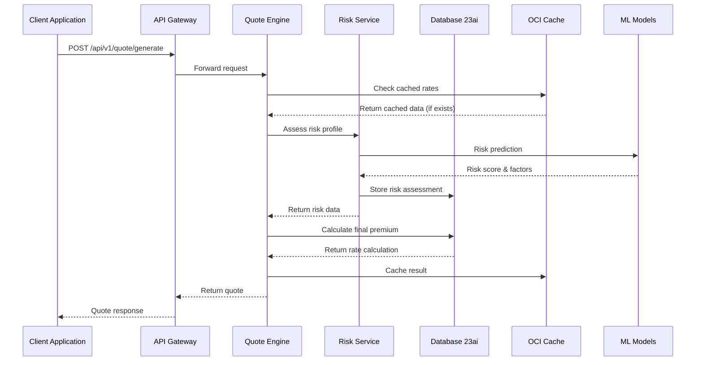
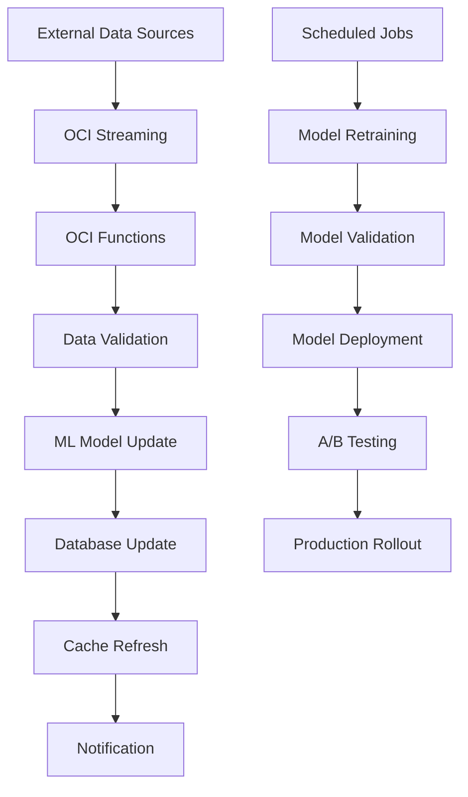

# Technical Architecture: Design Pattern 21 - Intelligent Insurance Rate Modeling

## Architecture Overview

The Intelligent Insurance Rate Modeling solution is built on Oracle Cloud Infrastructure (OCI) using a microservices architecture that enables real-time quote generation, dynamic pricing, and regulatory compliance for insurance products including personal auto, homeowners, and commercial lines.

### High-Level Architecture Principles
- **Event-Driven Architecture**: Real-time processing of risk data and market changes
- **API-First Design**: Seamless integration with distribution channels and policy systems
- **Cloud-Native**: Scalable, resilient, and cost-effective infrastructure
- **Data-Centric**: Unified data platform for analytics and machine learning
- **Security by Design**: End-to-end encryption and compliance-ready architecture
- **Microservices**: Loosely coupled services for maintainability and scalability

---

## System Architecture Diagram

```
┌─────────────────────────────────────────────────────────────────────────────────┐
│                           EXTERNAL DATA SOURCES                                 │
├─────────────────┬─────────────────┬─────────────────┬─────────────────────────┤
│   LexisNexis    │     Verisk      │      ISO        │   Weather/IoT/Market    │
│   (MVR, CLUE)   │  (Cat Models)   │ (Rating Data)   │      (Real-time)        │
└─────────┬───────┴─────────┬───────┴─────────┬───────┴─────────────┬───────────┘
          │                 │                 │                     │
          └─────────────────┼─────────────────┼─────────────────────┘
                           │                 │
          ┌─────────────────┴─────────────────┴─────────────────────┐
          │                OCI STREAMING                             │
          │        (Event Ingestion & Real-time Processing)         │
          └─────────────────┬─────────────────────────────────────────┘
                           │
    ┌─────────────────────────────────────────────────────────────────────────────┐
    │                          DATA PROCESSING LAYER                             │
    ├─────────────────┬─────────────────┬─────────────────┬─────────────────────┤
    │  OCI Functions  │      OCI        │   Document      │     Anomaly         │
    │  (Transform)    │   Data Science  │ Understanding   │   Detection         │
    │                 │  (ML Models)    │ (Extract Data)  │ (Fraud Detection)   │
    └─────────┬───────┴─────────┬───────┴─────────┬───────┴─────────┬───────────┘
              │                 │                 │                 │
              └─────────────────┼─────────────────┼─────────────────┘
                               │                 │
      ┌─────────────────────────────────────────────────────────────────────────────┐
      │                        CORE DATA PLATFORM                                  │
      ├─────────────────┬─────────────────┬─────────────────┬─────────────────────┤
      │ Oracle Database │  OCI Object     │   Data Catalog  │    Cache (Redis)    │
      │     23ai        │    Storage      │  (Metadata)     │  (Fast Retrieval)   │
      │  (Operational)  │ (Documents/ML)  │                 │                     │
      └─────────┬───────┴─────────┬───────┴─────────┬───────┴─────────┬───────────┘
                │                 │                 │                 │
                └─────────────────┼─────────────────┼─────────────────┘
                                 │                 │
    ┌─────────────────────────────────────────────────────────────────────────────────┐
    │                        RATE CALCULATION ENGINE                                  │
    ├─────────────────┬─────────────────┬─────────────────┬─────────────────────────┤
    │  Risk Assessment│   Base Rate     │   Territorial   │   Regulatory            │
    │     Service     │    Service      │    Factors      │   Compliance            │
    │                 │                 │    Service      │    Service              │
    └─────────┬───────┴─────────┬───────┴─────────┬───────┴─────────┬───────────────┘
              │                 │                 │                 │
              └─────────────────┼─────────────────┼─────────────────┘
                               │                 │
      ┌─────────────────────────────────────────────────────────────────────────────┐
      │                           API GATEWAY                                       │
      │              (Rate Calculation APIs & Orchestration)                       │
      └─────────────────┬─────────────────┬─────────────────┬─────────────────────┘
                       │                 │                 │
       ┌─────────────────────────────────────────────────────────────────────────────┐
       │                     INTEGRATION LAYER                                      │
       ├─────────────────┬─────────────────┬─────────────────┬─────────────────────┤
       │     Oracle      │   OCI Events    │  Notifications  │      Logging        │
       │  Integration    │   (Triggers)    │   (Alerts)      │   (Audit Trail)     │
       │     Cloud       │                 │                 │                     │
       └─────────┬───────┴─────────┬───────┴─────────┬───────┴─────────┬───────────┘
                 │                 │                 │                 │
                 └─────────────────┼─────────────────┼─────────────────┘
                                  │                 │
     ┌─────────────────────────────────────────────────────────────────────────────────┐
     │                      SECURITY & GOVERNANCE LAYER                               │
     ├─────────────────┬─────────────────┬─────────────────┬─────────────────────────┤
     │   OCI Vault     │  Cloud Guard    │   Data Safe     │    Identity & Access    │
     │ (Key Mgmt)      │  (Security)     │  (DB Security)  │    Management (IAM)     │
     └─────────────────┴─────────────────┴─────────────────┴─────────────────────────┘

     ┌─────────────────────────────────────────────────────────────────────────────────┐
     │                       DISTRIBUTION CHANNELS                                     │
     ├─────────────────┬─────────────────┬─────────────────┬─────────────────────────┤
     │   Web Portal    │   Mobile App    │  Agent Portal   │   Policy Admin System  │
     │                 │                 │                 │        (PAS)            │
     └─────────────────┴─────────────────┴─────────────────┴─────────────────────────┘
```

---

## Component Architecture Details

### 1. Data Ingestion & Processing Layer

#### OCI Streaming
```yaml
Configuration:
  - Partitions: 10-50 (based on data volume)
  - Retention: 7 days
  - Throughput: 1MB/sec per partition
  
Data Sources:
  - External risk data providers
  - IoT/telematics devices
  - Market data feeds
  - Regulatory updates
  - Claims system updates

Message Format:
  {
    "source": "lexisnexis|verisk|iot|internal",
    "timestamp": "ISO-8601",
    "risk_data": {...},
    "customer_id": "encrypted",
    "data_type": "claim|application|market|regulatory"
  }
```

#### OCI Functions (Data Processing)
```python
# Example Risk Data Transformation Function
import json
import oci
from datetime import datetime

def risk_data_transformer(ctx, data: io.BytesIO = None):
    """
    Transform incoming risk data into standardized format
    """
    payload = json.loads(data.getvalue())
    
    # Data validation and cleansing
    validated_data = validate_risk_data(payload)
    
    # Enrichment with historical context
    enriched_data = enrich_with_history(validated_data)
    
    # Store in Database 23ai
    store_risk_data(enriched_data)
    
    # Trigger rate recalculation if needed
    if should_trigger_rate_update(enriched_data):
        trigger_rate_update(enriched_data)
    
    return {"status": "processed", "timestamp": datetime.now().isoformat()}
```

### 2. AI/ML Services Layer

#### OCI Data Science (Risk Modeling)
```python
# Risk Assessment Model Architecture
class InsuranceRiskModel:
    def __init__(self):
        self.models = {
            'auto': AutoRiskModel(),
            'home': HomeRiskModel(),
            'commercial': CommercialRiskModel()
        }
    
    def assess_risk(self, application_data, product_type):
        """
        Multi-factor risk assessment using ensemble methods
        """
        base_model = self.models[product_type]
        
        # Feature engineering
        features = self.extract_features(application_data)
        
        # Risk scoring
        risk_score = base_model.predict(features)
        
        # Explainability for regulatory compliance
        explanations = base_model.explain_prediction(features)
        
        return {
            'risk_score': risk_score,
            'risk_factors': explanations,
            'confidence_interval': base_model.confidence_interval(features)
        }
```

#### Document Understanding Integration
```yaml
Document Processing Pipeline:
  Input: PDF applications, images, forms
  Extract:
    - Personal information
    - Property details
    - Vehicle specifications
    - Claims history
    - Supporting documentation
  
  Output Format:
    {
      "applicant": {
        "name": "string",
        "age": "integer",
        "license_info": {...}
      },
      "property": {
        "address": "string",
        "construction_details": {...},
        "risk_factors": [...]
      },
      "confidence_scores": {...}
    }
```

### 3. Core Data Platform

#### Oracle Database 23ai Schema
```sql
-- Core Rate Calculation Tables
CREATE TABLE risk_profiles (
    profile_id VARCHAR2(50) PRIMARY KEY,
    product_type VARCHAR2(20) NOT NULL,
    risk_factors JSON,
    base_premium NUMBER(10,2),
    territorial_factor NUMBER(5,4),
    experience_mod NUMBER(5,4),
    effective_date DATE,
    created_timestamp TIMESTAMP WITH TIME ZONE DEFAULT CURRENT_TIMESTAMP
);

-- AI-enabled risk scoring
CREATE TABLE ai_risk_scores (
    score_id VARCHAR2(50) PRIMARY KEY,
    customer_id VARCHAR2(50),
    product_type VARCHAR2(20),
    risk_score NUMBER(5,4),
    model_version VARCHAR2(10),
    feature_importance JSON,
    confidence_level NUMBER(5,4),
    scored_timestamp TIMESTAMP WITH TIME ZONE DEFAULT CURRENT_TIMESTAMP
);

-- Real-time rate cache
CREATE TABLE current_rates (
    rate_id VARCHAR2(50) PRIMARY KEY,
    product_type VARCHAR2(20),
    territory VARCHAR2(10),
    risk_tier VARCHAR2(10),
    base_rate NUMBER(10,2),
    last_updated TIMESTAMP WITH TIME ZONE,
    CONSTRAINT uk_rate_unique UNIQUE (product_type, territory, risk_tier)
);

-- Vector embeddings for similarity matching
CREATE TABLE risk_embeddings (
    embedding_id VARCHAR2(50) PRIMARY KEY,
    customer_profile VECTOR(1536),
    risk_category VARCHAR2(50),
    similarity_threshold NUMBER(5,4)
);
```

#### OCI Object Storage Structure
```
insurance-rate-modeling-bucket/
├── models/
│   ├── auto_risk_model_v1.2.pkl
│   ├── home_risk_model_v1.1.pkl
│   └── commercial_risk_model_v1.0.pkl
├── documents/
│   ├── applications/
│   ├── supporting_docs/
│   └── processed_extracts/
├── external_data/
│   ├── lexisnexis/
│   ├── verisk/
│   └── iso/
└── regulatory/
    ├── rate_filings/
    ├── compliance_docs/
    └── audit_trails/
```

### 4. Rate Calculation Engine

#### Microservices Architecture
```yaml
Risk Assessment Service:
  Endpoint: /api/v1/risk/assess
  Function: Calculate individual risk scores
  Dependencies: Database 23ai, ML Models
  SLA: <100ms response time

Base Rate Service:
  Endpoint: /api/v1/rates/base
  Function: Retrieve base rates by product/territory
  Dependencies: Database 23ai, Cache
  SLA: <50ms response time

Territorial Factors Service:
  Endpoint: /api/v1/territorial/{zipcode}
  Function: Geographic risk adjustments
  Dependencies: External data sources
  SLA: <75ms response time

Regulatory Compliance Service:
  Endpoint: /api/v1/compliance/validate
  Function: Ensure rate compliance
  Dependencies: Regulatory database
  SLA: <200ms response time

Quote Engine Service:
  Endpoint: /api/v1/quote/generate
  Function: Orchestrate full quote calculation
  Dependencies: All above services
  SLA: <500ms response time
```

#### Rate Calculation Algorithm
```python
class RateCalculationEngine:
    def calculate_premium(self, application_data):
        """
        Multi-step premium calculation with regulatory compliance
        """
        # Step 1: Base rate lookup
        base_rate = self.get_base_rate(
            product_type=application_data.product_type,
            territory=application_data.territory
        )
        
        # Step 2: Risk assessment
        risk_assessment = self.assess_risk(application_data)
        
        # Step 3: Apply risk factors
        risk_adjusted_rate = base_rate * risk_assessment.risk_multiplier
        
        # Step 4: Territorial adjustments
        territorial_factor = self.get_territorial_factor(
            zipcode=application_data.zipcode
        )
        
        # Step 5: Experience modifications
        experience_mod = self.calculate_experience_mod(
            claims_history=application_data.claims_history
        )
        
        # Step 6: Final premium calculation
        final_premium = (risk_adjusted_rate * 
                        territorial_factor * 
                        experience_mod)
        
        # Step 7: Regulatory compliance validation
        compliance_check = self.validate_compliance(
            final_premium, application_data
        )
        
        if not compliance_check.is_compliant:
            final_premium = compliance_check.adjusted_premium
        
        return {
            'premium': final_premium,
            'breakdown': {
                'base_rate': base_rate,
                'risk_multiplier': risk_assessment.risk_multiplier,
                'territorial_factor': territorial_factor,
                'experience_mod': experience_mod
            },
            'risk_factors': risk_assessment.risk_factors,
            'compliance_status': compliance_check.status
        }
```

### 5. API Gateway Configuration

#### API Specifications (OpenAPI 3.0)
```yaml
openapi: 3.0.0
info:
  title: Insurance Rate Modeling API
  version: 1.0.0
  description: Intelligent rate calculation and quote generation

paths:
  /api/v1/quote/generate:
    post:
      summary: Generate insurance quote
      requestBody:
        required: true
        content:
          application/json:
            schema:
              $ref: '#/components/schemas/QuoteRequest'
      responses:
        '200':
          description: Quote generated successfully
          content:
            application/json:
              schema:
                $ref: '#/components/schemas/QuoteResponse'
        '400':
          description: Invalid request data
        '429':
          description: Rate limit exceeded
        '500':
          description: Internal server error

  /api/v1/risk/assess:
    post:
      summary: Assess risk profile
      security:
        - ApiKeyAuth: []
      requestBody:
        required: true
        content:
          application/json:
            schema:
              $ref: '#/components/schemas/RiskRequest'
      responses:
        '200':
          description: Risk assessment completed

components:
  schemas:
    QuoteRequest:
      type: object
      required:
        - product_type
        - applicant_info
        - coverage_details
      properties:
        product_type:
          type: string
          enum: [auto, home, commercial]
        applicant_info:
          $ref: '#/components/schemas/ApplicantInfo'
        coverage_details:
          $ref: '#/components/schemas/CoverageDetails'
    
    QuoteResponse:
      type: object
      properties:
        quote_id:
          type: string
        premium:
          type: number
        coverage_breakdown:
          type: object
        risk_score:
          type: number
        expiration_date:
          type: string
          format: date-time

  securitySchemes:
    ApiKeyAuth:
      type: apiKey
      in: header
      name: X-API-Key
```

#### Rate Limiting & Throttling
```yaml
Rate Limiting Configuration:
  Tiers:
    - Basic: 100 requests/minute
    - Premium: 1000 requests/minute
    - Enterprise: 10000 requests/minute
  
  Throttling Rules:
    - Burst capacity: 2x sustained rate
    - Backoff strategy: Exponential
    - Circuit breaker: After 5 consecutive failures
```

### 6. Security Architecture

#### Security Layers
```yaml
Network Security:
  - VCN with private subnets for data processing
  - WAF for API protection
  - DDoS protection enabled
  - Network Security Groups (NSGs)

Data Security:
  - Encryption at rest: AES-256
  - Encryption in transit: TLS 1.3
  - Database: Transparent Data Encryption (TDE)
  - Keys managed via OCI Vault

Application Security:
  - OAuth 2.0 / OpenID Connect
  - API key authentication
  - Role-based access control (RBAC)
  - JWT tokens for session management

Compliance:
  - SOC 2 Type II compliance
  - PCI DSS for payment data
  - State insurance regulations
  - GDPR for EU data subjects
```

#### Identity and Access Management
```yaml
IAM Configuration:
  Groups:
    - Underwriters: Read/Write access to risk assessments
    - Actuaries: Full access to models and rates
    - Agents: Read-only access to quote APIs
    - Administrators: Full system access
    - Auditors: Read-only access to audit logs

  Policies:
    - Principle of least privilege
    - Multi-factor authentication required
    - Session timeout: 8 hours
    - Password policy: Complex, 90-day rotation
```

### 7. Integration Patterns

#### Policy Administration System Integration
```yaml
Integration Pattern: Event-Driven Architecture

Events Published:
  - quote.generated
  - rate.updated
  - risk.assessed
  - compliance.validated

Events Consumed:
  - policy.issued
  - claim.filed
  - payment.received
  - policy.cancelled

Message Format (CloudEvents):
  specversion: "1.0"
  type: "com.insurance.quote.generated"
  source: "/rate-modeling-engine"
  id: "quote-12345"
  time: "2025-01-15T10:30:00Z"
  datacontenttype: "application/json"
  data:
    quote_id: "12345"
    customer_id: "customer-789"
    premium: 1250.00
    product_type: "auto"
```

#### External Data Provider Integration
```python
# Example: LexisNexis Integration
class LexisNexisConnector:
    def __init__(self, api_key, endpoint):
        self.api_key = api_key
        self.endpoint = endpoint
        self.session = requests.Session()
    
    async def get_mvr_report(self, license_number, state):
        """
        Retrieve Motor Vehicle Record
        """
        payload = {
            'license_number': license_number,
            'state': state,
            'report_type': 'MVR'
        }
        
        headers = {
            'Authorization': f'Bearer {self.api_key}',
            'Content-Type': 'application/json'
        }
        
        try:
            response = await self.session.post(
                f'{self.endpoint}/mvr',
                json=payload,
                headers=headers,
                timeout=30
            )
            response.raise_for_status()
            
            mvr_data = response.json()
            
            # Transform to internal format
            return self.transform_mvr_data(mvr_data)
            
        except requests.exceptions.RequestException as e:
            logger.error(f"LexisNexis API error: {e}")
            raise ExternalDataException(f"Failed to retrieve MVR: {e}")
```

---

## Deployment Architecture

### Multi-Region Deployment
```yaml
Primary Region (us-phoenix-1):
  Components:
    - All core services
    - Primary database
    - Real-time processing
  
Secondary Region (us-ashburn-1):
  Components:
    - Disaster recovery database
    - Backup processing capabilities
    - Read replicas for reporting

Data Synchronization:
  - Database: Data Guard (Real-time sync)
  - Object Storage: Cross-region replication
  - Models: Automated sync every 4 hours
```

### Container Orchestration (OKE)
```yaml
Kubernetes Configuration:
  Cluster:
    - Node pools: 3 (compute, memory-optimized, GPU)
    - Auto-scaling: 2-20 nodes per pool
    - Network: CNI with Network Policies
  
  Deployments:
    - Rate calculation services: 3 replicas
    - API Gateway: 2 replicas
    - Data processing: 5 replicas
    - ML inference: 2 GPU replicas
  
  Services:
    - Load balancer: OCI Load Balancer
    - Service mesh: Istio (optional)
    - Ingress: NGINX Ingress Controller
```

### Monitoring and Observability
```yaml
Monitoring Stack:
  Metrics:
    - OCI Monitoring (native)
    - Prometheus (custom metrics)
    - Grafana (visualization)
  
  Logging:
    - OCI Logging (centralized)
    - Fluentd (log aggregation)
    - ELK Stack (analysis)
  
  Tracing:
    - Jaeger (distributed tracing)
    - OpenTelemetry (instrumentation)
  
  Alerting:
    - OCI Notifications
    - PagerDuty integration
    - Slack notifications
```

### Performance Requirements
```yaml
SLA Targets:
  - Quote generation: <500ms (95th percentile)
  - Risk assessment: <100ms
  - API availability: 99.9%
  - Database response: <50ms
  
Scalability:
  - Concurrent quotes: 10,000
  - Daily quote volume: 1M+
  - Peak throughput: 1,000 quotes/second
  - Data processing: 100GB/hour
```

---

## Data Flow Architecture

### Real-Time Quote Generation Flow


### Batch Processing Flow


---

## Disaster Recovery & Business Continuity

### Recovery Time Objectives (RTO) & Recovery Point Objectives (RPO)
```yaml
Critical Services:
  Quote Generation API:
    RTO: 15 minutes
    RPO: 5 minutes
  
  Risk Assessment:
    RTO: 30 minutes
    RPO: 15 minutes
  
  Historical Data:
    RTO: 4 hours
    RPO: 1 hour

Backup Strategy:
  Database:
    - Continuous backup enabled
    - Point-in-time recovery
    - Cross-region replication
  
  Application Code:
    - Git repository with automated backups
    - Container images in OCI Registry
    - Infrastructure as Code in version control
  
  ML Models:
    - Versioned storage in Object Storage
    - Automated model registry
    - Cross-region model replication
```

### Failover Procedures
```yaml
Automated Failover:
  Triggers:
    - Health check failures (3 consecutive)
    - Response time degradation (>2x SLA)
    - Database connectivity issues
  
  Actions:
    - Route traffic to secondary region
    - Activate read replicas
    - Scale up secondary resources
    - Notify operations team

Manual Procedures:
  1. Assess scope of outage
  2. Execute failover checklist
  3. Validate service restoration
  4. Communicate status to stakeholders
  5. Conduct post-incident review
```

---

## Cost Optimization Strategies

### Resource Optimization
```yaml
Auto-Scaling Policies:
  Quote Processing:
    - Scale out: CPU > 70% for 5 minutes
    - Scale in: CPU < 30% for 10 minutes
    - Min instances: 2
    - Max instances: 20
  
  ML Inference:
    - Scale based on queue depth
    - GPU utilization > 80%
    - Cold start optimization
  
  Database:
    - Auto-scaling enabled
    - Storage optimization
    - Query performance tuning

Reserved Capacity:
  - 1-year term for baseline capacity
  - 3-year term for predictable workloads
  - Flex shapes for variable workloads
```

### Cost Monitoring
```yaml
Budget Controls:
  - Monthly budget: $75,000
  - Alert thresholds: 50%, 80%, 95%
  - Automatic shutdown of non-prod environments
  - Resource tagging for cost allocation

Optimization Recommendations:
  - Right-sizing recommendations
  - Unused resource identification
  - Reserved instance analysis
  - Storage optimization suggestions
```

---

*This technical architecture provides a comprehensive foundation for implementing intelligent insurance rate modeling with Oracle Cloud Infrastructure, ensuring scalability, reliability, security, and regulatory compliance for enterprise insurance operations.*